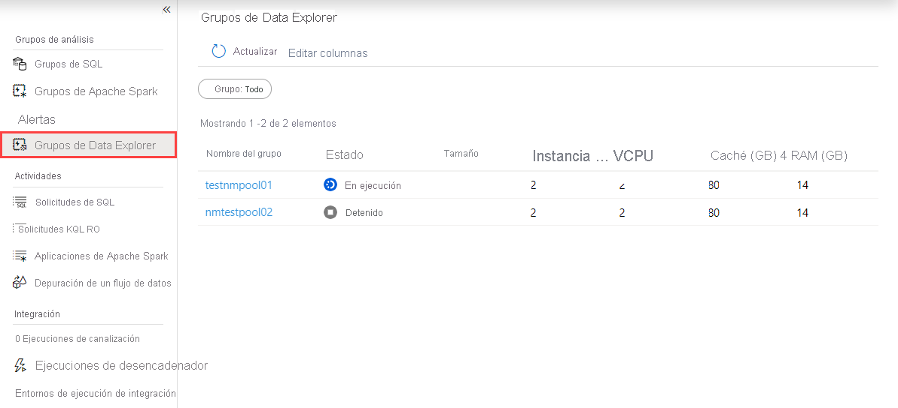
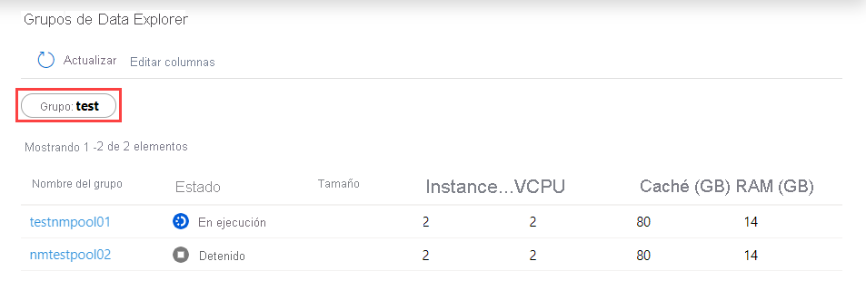

# Inicio rápido: Uso de Synapse Studio para supervisar los grupos de Data Explorer (versión preliminar)

Con Azure Synapse Analytics, puede usar Data Explorer para ejecutar consultas, paneles y mucho más en grupos de Data Explorer del área de trabajo.

En este artículo se explica cómo supervisar los grupos de Data Explorer, lo que le permite vigilar el estado de los grupos, como el número de núcleos virtuales que usan los distintos usuarios del área de trabajo.

## Acceso a la lista de grupos de Data Explorer

Para ver la lista de grupos de Data Explorer del área de trabajo, primero [abra Synapse Studio](https://web.azuresynapse.net/) y seleccione el área de trabajo.

Una vez que haya abierto el área de trabajo, seleccione la sección **Supervisar** a la izquierda.

Seleccione **Data Explorer pools** (Grupos de data Explorer) para ver la lista de grupos de Data Explorer.

## Filtrado de los grupos de Data Explorer

Puede filtrar la lista de grupos de Data Explorer por los que le interesen. Los filtros en la parte superior de la pantalla le permiten especificar un campo por el que desea filtrar.

Por ejemplo, puede filtrar la vista para ver solo los grupos de Data Explorer que contienen el nombre "test":

## Visualización de los detalles sobre un grupo de Data Explorer específico

Para ver los detalles sobre uno de los grupos de Data Explorer, seleccione el grupo para ver los detalles.

