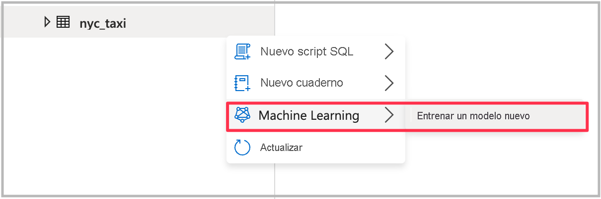
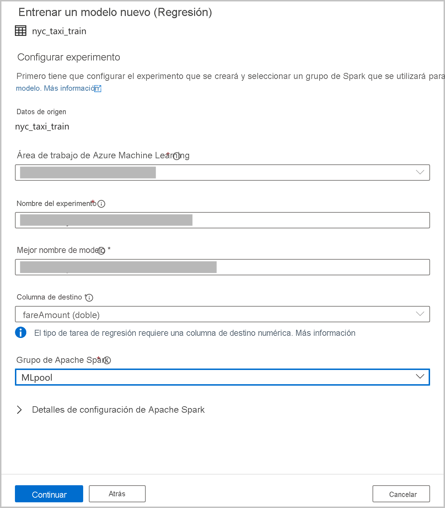
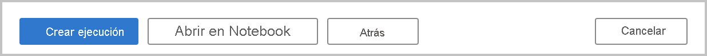
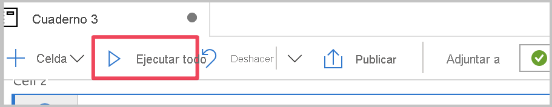
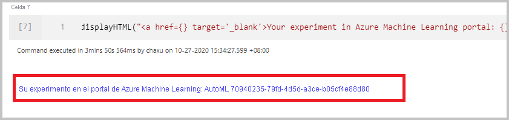

# Tutorial: Entrenamiento de modelos de Machine Learning sin código

Puede enriquecer fácilmente los datos de las tablas de Spark con los nuevos modelos de Machine Learning que puede entrenar mediante el [aprendizaje automático automatizado](../../machine-learning/concept-automated-ml.md). En Azure Synapse Analytics, puede seleccionar una tabla de Spark en el área de trabajo y utilizarla como conjunto de datos de entrenamiento para crear modelos de Machine Learning. Es posible hacerlo mediante una experiencia sin código.

En este tutorial, aprenderá a entrenar modelos de Machine Learning mediante una experiencia sin código en Synapse Studio. Synapse Studio es una característica de Azure Synapse Analytics. 

Utilizará el aprendizaje automático automatizado de Azure Machine Learning, en lugar de codificar la experiencia de forma manual. El tipo de modelo que entrena depende del problema que esté intentando resolver. En este tutorial, usará un modelo de regresión para predecir las tarifas de taxi del conjunto de datos de taxis de la ciudad de Nueva York.

Si no tiene una suscripción a Azure, [cree una cuenta gratuita antes de empezar](https://azure.microsoft.com/free/).

## Requisitos previos

- Un [área de trabajo de Azure Synapse Analytics](../get-started-create-workspace.md). Asegúrese de que tiene una cuenta de almacenamiento de Azure Data Lake Storage Gen2 configurada como almacenamiento predeterminado. En el caso del sistema de archivos Data Lake Storage Gen2 con el que trabaja, asegúrese de ser el *colaborador de datos de blobs de almacenamiento*.
- Un grupo de Apache Spark (versión 2.4) en el área de trabajo de Azure Synapse Analytics. Para obtener más información, vea [Inicio rápido: Creación de un grupo de Apache Spark sin servidor mediante Synapse Studio](../quickstart-create-apache-spark-pool-studio.md).
- Un servicio vinculado de Azure Machine Learning en el área de trabajo de Azure Synapse Analytics. Para más información, consulte [Inicio rápido: Creación de un servicio vinculado de Azure Machine Learning en Synapse](quickstart-integrate-azure-machine-learning.md).

## Inicio de sesión en Azure Portal

Inicie sesión en [Azure Portal](https://portal.azure.com/).

## Creación de una tabla de Spark para el conjunto de datos de entrenamiento

Para este tutorial, necesitará una tabla de Spark. El siguiente cuaderno crea uno:

1. Descargue el cuaderno [Create-Spark-Table-NYCTaxi- Data.ipynb](https://go.microsoft.com/fwlink/?linkid=2149229).

1. Importe el cuaderno en Synapse Studio.

   

1. Seleccione el grupo de Spark que quiere utilizar y, después, haga clic en **Run all** (Ejecutar todo). Este paso permite obtener los datos de los taxis de Nueva York desde el conjunto de datos abierto y guardarlos en la base de datos de Spark predeterminada.

   

1. Una vez finalizada la ejecución del cuaderno, verá una nueva tabla de Spark en la base de datos de Spark predeterminada. En **Data** (Datos), busque la tabla denominada **nyc_taxi**.

   

## Abrir el Asistente para el aprendizaje automático automatizado

Para abrir el asistente, haga clic con el botón derecho en la tabla de Spark que creó en el paso anterior. Después, seleccione **Machine Learning** > **Train a new model** (Entrenar un modelo nuevo).

## Elegir un tipo de modelo

Seleccione el tipo de modelo de Machine Learning para el experimento en función de la pregunta a la que intenta responder. Dado que el valor que intenta predecir es numérico (tarifas de taxi), seleccione **Regression** (Regresión) aquí. Después, seleccione **Continuar**.

## Configuración del experimento

1. Proporcione los detalles de configuración para crear una ejecución del experimento de aprendizaje automático automatizado en Azure Machine Learning. En esta ejecución se entrenan varios modelos. El mejor modelo de una ejecución correcta se registra en el registro de modelos de Azure Machine Learning.

   

    - **Un área de trabajo de Azure Machine Learning**: se requiere un área de trabajo de Azure Machine Learning para crear una ejecución del experimento de aprendizaje automático automatizado. También tiene que vincular el área de trabajo de Azure Synapse Analytics con el área de trabajo de Azure Machine Learning mediante un [servicio vinculado](quickstart-integrate-azure-machine-learning.md). Una vez que haya completado todos los requisitos previos, puede especificar el área de trabajo de Azure Machine Learning que quiera utilizar para esta ejecución automatizada.

    - **Nombre del experimento**: especifique el nombre del experimento. Cuando envía una ejecución de aprendizaje automático automatizado, especifica un nombre de experimento. La información de la ejecución se almacena en ese experimento en el área de trabajo de Azure Machine Learning. Esta experiencia crea un nuevo experimento de forma predeterminada y genera un nombre propuesto, pero también puede proporcionar el nombre de un experimento existente.

    - **El nombre del mejor modelo**: especifique el nombre del mejor modelo de la ejecución automatizada. Al mejor modelo se le asigna este nombre y se guarda en el registro de modelos de Azure Machine Learning automáticamente después de esta ejecución. Un aprendizaje automático automatizado crea muchos modelos de aprendizaje automático. En función de la métrica principal que seleccione en un paso posterior, estos modelos se pueden comparar, y es posible seleccionar el mejor modelo.

    - **Target column** (Columna de destino): esto es lo que tendrá que predecir el modelo entrenado. Elija la columna del conjunto de datos que contiene los datos que desea predecir. En este tutorial, seleccionamos la columna numérica `fareAmount` como columna de destino.

    - **Grupo de Spark**: especifique el grupo de Spark que quiere utilizar para la ejecución del experimento automatizada. Los cálculos se ejecutan en el grupo que especifique.

    - **Detalles de configuración de Spark**: además del grupo de Spark, tiene la opción de proporcionar detalles de la configuración de sesión.

1. Seleccione **Continuar**.

## Configuración del modelo

Dado que ha seleccionado **Regression** (Regresión) como tipo de modelo en la sección anterior, están disponibles las siguientes configuraciones, que también están disponibles para el tipo de modelo **Classification** (Clasificación):

- **Métrica primaria**: especifique la métrica que mide el grado de funcionamiento del modelo. Puede usar esta métrica para comparar los diferentes modelos creados en la ejecución automatizada y determinar qué modelo ha funcionado mejor.

- **Tiempo de trabajo de entrenamiento (horas)** : especifique la cantidad máxima de tiempo, en horas, de un experimento para ejecutar y entrenar modelos. Tenga en cuenta que también puede proporcionar valores inferiores a 1 (por ejemplo, **0,5**).

- **Número máximo de iteraciones simultáneas**: elija el número máximo de iteraciones ejecutadas en paralelo.

- **Compatibilidad con el modelo de ONNX**: Si habilita esta opción, los modelos entrenados mediante el aprendizaje automático automatizado se convierten al formato ONNX. Es especialmente pertinente si quiere utilizar el modelo para la puntuación en grupos de SQL de Azure Synapse Analytics.

Todas estas opciones tienen un valor predeterminado que se puede personalizar.

## Inicio de una ejecución

Una vez que se hayan realizado todas las configuraciones necesarias, puede iniciar la ejecución automatizada. Puede elegir crear una ejecución directamente seleccionando **Create run** (Crear ejecución); esto inicia la ejecución sin código. Si prefiere el código, puede seleccionar **Open in notebook** (Abrir en Notebook). Esta opción abre un cuaderno que contiene el código que crea la ejecución; así puede ver el código e iniciar la ejecución directamente.

>[!NOTE]
>Si ha seleccionado **Time series forecasting** (Previsión de series temporales) como tipo de modelo en la sección anterior, debe crear configuraciones adicionales. La previsión tampoco admite compatibilidad con modelos ONNX.

### Creación de una ejecución directamente

Para iniciar la ejecución de aprendizaje automático automatizada directamente, seleccione **Create Run** (Crear ejecución). Ve una notificación en la que se indica que se está iniciando la ejecución. A continuación, verá otra notificación en la que se indica que la operación se ha realizado correctamente. También puede comprobar el estado en Azure Machine Learning seleccionando el vínculo de la notificación.

### Creación de una ejecución con un cuaderno

Para generar un cuaderno, seleccione **Open in notebook** (Abrir en Notebook). Esto le ofrece la oportunidad de agregar la configuración o modificar el código de la ejecución de aprendizaje automático automatizado. Cuando esté listo para ejecutar el código, seleccione **Run all** (Ejecutar todo).

## Supervisión de la ejecución

Una vez que haya enviado la ejecución del cuaderno correctamente, verá un vínculo a la ejecución del experimento en el área de trabajo de Azure Machine Learning en la salida del cuaderno. Seleccione el vínculo para supervisar la ejecución automatizada en Azure Machine Learning.

## Pasos siguientes

- [Tutorial: Asistente para puntuación de modelos de Machine Learning (versión preliminar) para grupos de SQL dedicados](tutorial-sql-pool-model-scoring-wizard.md)
- [Inicio rápido: Creación de un servicio vinculado de Azure Machine Learning en Azure Synapse Analytics](quickstart-integrate-azure-machine-learning.md)
- [Funcionalidades de aprendizaje automático en Azure Synapse Analytics](what-is-machine-learning.md)
