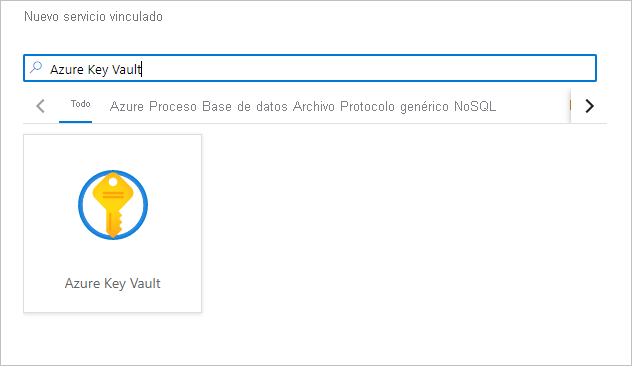
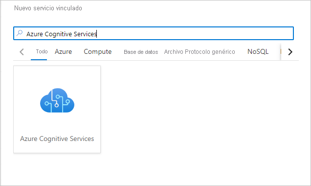

# Inicio rápido: Configuración de los requisitos previos para usar Cognitive Services en Azure Synapse Analytics

En este inicio rápido, aprenderá a configurar los requisitos previos para usar Azure Cognitive Services en Azure Synapse Analytics de forma segura. La vinculación de Azure Cognitive Services le permite aprovechar Azure Cognitive Services desde varias experiencias en Synapse.

Esta guía de inicio rápido incluye:
> [!div class="checklist"]
> - La creación de un recurso de Cognitive Services, como Text Analytics o Anomaly Detector.
> - El almacenamiento de una clave de autenticación para los recursos de Cognitive Services como secretos en Azure Key Vault, y la configuración del acceso para un área de trabajo de Azure Synapse Analytics.
> - La creación de un servicio vinculado de Azure Key Vault en el área de trabajo de Azure Synapse Analytics.
> - La creación de un servicio vinculado de Azure Cognitive Services en el área de trabajo de Azure Synapse Analytics.

Si no tiene una suscripción a Azure, [cree una cuenta gratuita antes de empezar](https://azure.microsoft.com/free/).

## Requisitos previos

- Un [área de trabajo de Azure Synapse Analytics](../get-started-create-workspace.md) con una cuenta de Azure Data Lake Storage Gen2 configurada como ubicación de almacenamiento predeterminado. Asegúrese de ser el *colaborador de datos de blobs de almacenamiento* en el sistema de archivos de Azure Data Lake Storage Gen2 en el que está trabajando.

## Inicio de sesión en Azure Portal

Inicie sesión en [Azure Portal](https://portal.azure.com/).

## Creación de un recurso de Cognitive Services

[Azure Cognitive Services](../../cognitive-services/index.yml) incluye muchos tipos de servicios. Text Analytics y Anomaly Detector son dos ejemplos en los tutoriales de Azure Synapse.

Puede crear un recurso de [Text Analytics](https://ms.portal.azure.com/#create/Microsoft.CognitiveServicesTextAnalytics) en Azure Portal:

Puede crear un recurso de [Anomaly Detector](https://ms.portal.azure.com/#create/Microsoft.CognitiveServicesTextAnalytics) en Azure Portal:

## Creación de un almacén de claves y configuración de los secretos y el acceso

1. Cree un [almacén de claves](https://ms.portal.azure.com/#create/Microsoft.KeyVault) en Azure Portal.
2. Vaya a **Key Vault** > **Directivas de acceso** y conceda permisos de [identidad administrada del área de trabajo de Azure Synapse](../security/synapse-workspace-managed-identity.md) para leer secretos de Azure Key Vault.

   > [!NOTE]
   > Asegúrese de que se guardan los cambios en la directiva. Este paso es fácil de pasar por alto.

   

3. Vaya al recurso de Cognitive Services. Por ejemplo, vaya a **Anomaly Detector** > **Claves y punto de conexión**. A continuación, copie una de las dos claves en el Portapapeles.

4. Vaya a **Key Vault** > **Secreto** para crear un secreto nuevo. Especifique el nombre del secreto y pegue la clave del paso anterior en el campo **Valor**. Por último, seleccione **Crear**.

   

   > [!IMPORTANT]
   > Asegúrese de memorizar o anotar este nombre de secreto. Lo usará más adelante al crear el servicio vinculado de Azure Cognitive Services.

## Creación de un servicio vinculado de Azure Key Vault en Azure Synapse

1. Abra el área de trabajo en Synapse Studio. 
2. Vaya a **Administrar** > **Servicios vinculados**. Cree un servicio vinculado de **Azure Key Vault**. Para ello, apunte al almacén de claves que acaba de crear. 
3. Seleccione el botón **Probar conexión** para comprobar la conexión. Si el color de la conexión es verde, seleccione **Crear** y, a continuación, **Publicar todo** para guardar el cambio.

## Creación de un servicio vinculado de Azure Cognitive Services en Azure Synapse

1. Abra el área de trabajo en Synapse Studio.
2. Vaya a **Administrar** > **Servicios vinculados**. Cree un servicio vinculado de **Azure Cognitive Services**. Para ello, apunte al servicio de Cognitive Services que acaba de crear. 
3. Seleccione el botón **Probar conexión** para comprobar la conexión. Si el color de la conexión es verde, seleccione **Crear** y, a continuación, **Publicar todo** para guardar el cambio.

Ya puede continuar con uno de los tutoriales para usar la experiencia de Azure Cognitive Services en Synapse Studio.

## Pasos siguientes

- [Tutorial: Análisis de sentimiento con Azure Cognitive Services](tutorial-cognitive-services-sentiment.md)
- [Tutorial: Detección de anomalías con Azure Cognitive Services](tutorial-cognitive-services-sentiment.md)
- [Tutorial: Asistente para puntuación del modelo de Machine Learning para grupos de SQL dedicados](tutorial-sql-pool-model-scoring-wizard.md).
- [Funcionalidades de aprendizaje automático en Azure Synapse Analytics](what-is-machine-learning.md)
