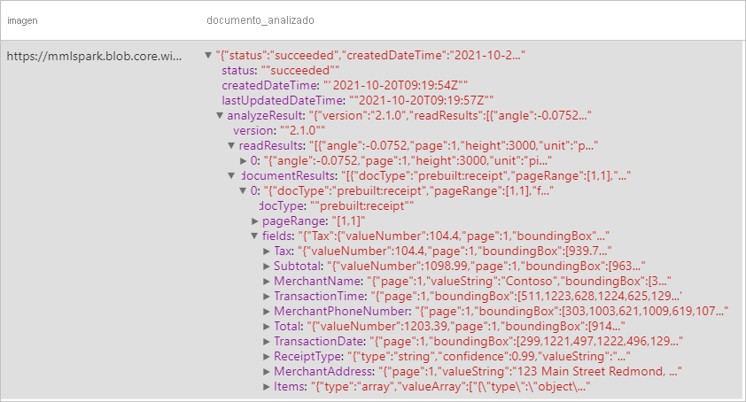
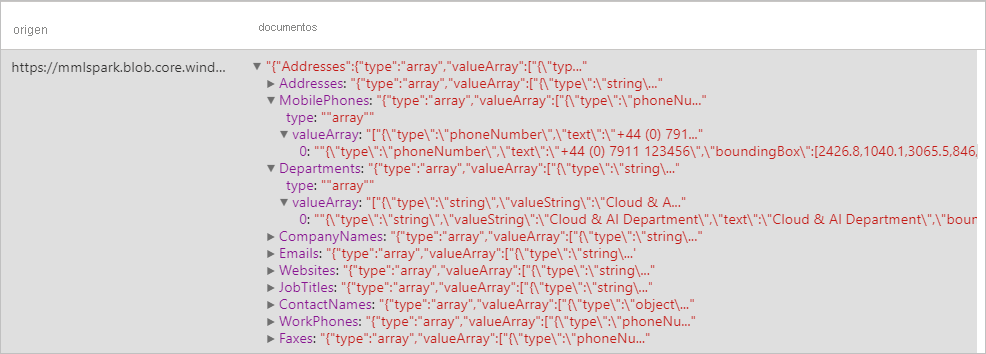
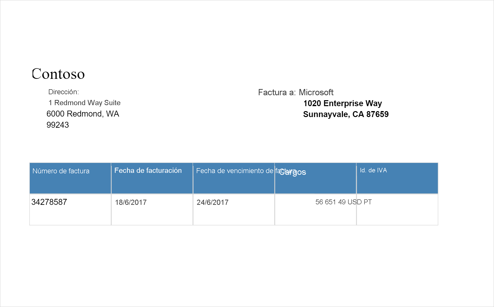
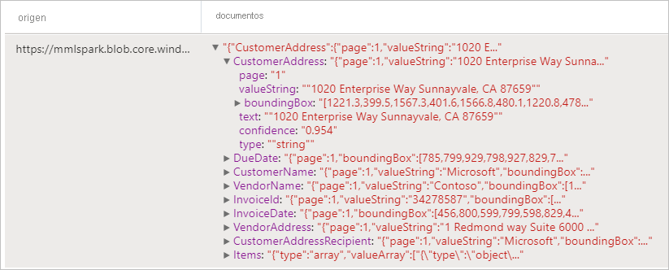
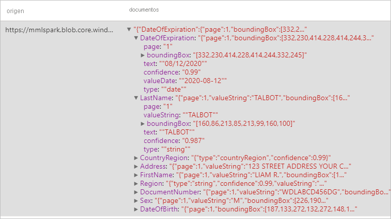

# <a name="tutorial-form-recognizer-with-applied-ai-service"></a>Tutorial: Form Recognizer con Applied AI Services

[Azure Form Recognizer](../../applied-ai-services/form-recognizer/index.yml) es uno de los servicios de [Azure Applied AI Services](../../applied-ai-services/index.yml) y permite crear una aplicación de procesamiento de datos automatizado mediante la tecnología de aprendizaje automático. En este tutorial, aprenderá a enriquecer fácilmente los datos en Azure Synapse Analytics. Utilizará [Form Recognizer](../../applied-ai-services/form-recognizer/index.yml) para analizar los formularios y documentos, extraer texto y datos, y devolver una salida JSON estructurada. Obtendrá rápidamente resultados precisos a la medida de su contenido específico sin necesidad de una intervención manual excesiva o una amplia experiencia en ciencia de datos. 

En este tutorial se muestra cómo usar Form Recognizer con [MMLSpark](https://github.com/Azure/mmlspark) para:

> [!div class="checklist"]
> - Extraer texto y diseño de un documento determinado
> - Detectar y extraer datos de recibos
> - Detectar y extraer datos de tarjetas de presentación
> - Detectar y extraer datos de facturas
> - Detectar y extraer datos de documentos de identificación


Si no tiene una suscripción a Azure, [cree una cuenta gratuita antes de empezar](https://azure.microsoft.com/free/).


## <a name="prerequisites"></a>Requisitos previos

- Necesitará un [área de trabajo de Azure Synapse Analytics](../get-started-create-workspace.md) con una cuenta de almacenamiento de Azure Data Lake Storage Gen2 que esté configurada como almacenamiento predeterminado. Asegúrese de que es el *colaborador de datos de Storage Blob* en el sistema de archivos de Data Lake Storage Gen2 con el que trabaja.
- Grupo de Spark en el área de trabajo de Azure Synapse Analytics. Para más información, consulte el artículo sobre [creación de un grupo de Spark en Azure Synapse](../quickstart-create-sql-pool-studio.md).
- Haber completado los pasos de configuración previos que se detallan en este tutorial sobre la [configuración de Cognitive Services en Azure Synapse](tutorial-configure-cognitive-services-synapse.md).


## <a name="get-started"></a>Introducción
Abra Synapse Studio y cree un cuaderno. Para empezar, importe [MMLSpark](https://github.com/Azure/mmlspark). 

```python
import mmlspark
from mmlspark.cognitive import *
```

## <a name="configure-form-recognizer"></a>Configuración de Form Recognizer 

Use la instancia de Form Recognizer que configuró en los [pasos de configuración previa](tutorial-configure-cognitive-services-synapse.md). 

```python
cognitive_service_name = "<Your linked service for form recognizer>"
```


## <a name="analyze-layout"></a>Análisis de diseño

Extrae texto e información del diseño de un documento determinado. El documento de entrada debe ser de uno de los tipos de contenido admitidos: "application/pdf", "image/jpeg", "image/png" o "image/tiff".

### <a name="example-input"></a>Entrada de ejemplo


```python
from pyspark.sql.functions import col, flatten, regexp_replace, explode, create_map, lit

imageDf = spark.createDataFrame([
  ("<replace with your file path>/layout.jpg",)
], ["source",])

analyzeLayout = (AnalyzeLayout()
                 .setLinkedService(cognitive_service_name)
                 .setImageUrlCol("source")
                 .setOutputCol("layout")
                 .setConcurrency(5))


display(analyzeLayout
        .transform(imageDf)
        .withColumn("lines", flatten(col("layout.analyzeResult.readResults.lines")))
        .withColumn("readLayout", col("lines.text"))
        .withColumn("tables", flatten(col("layout.analyzeResult.pageResults.tables")))
        .withColumn("cells", flatten(col("tables.cells")))
        .withColumn("pageLayout", col("cells.text"))
        .select("source", "readLayout", "pageLayout"))
```

### <a name="expected-results"></a>Resultados esperados


## <a name="analyze-receipts"></a>Análisis de recibos

Detecta y extrae datos de los recibos mediante el reconocimiento óptico de caracteres (OCR) y nuestro modelo de recibo, lo que le permite extraer fácilmente datos estructurados de los recibos como el nombre del comerciante, el número de teléfono del comerciante, la fecha de transacción, el total de transacciones, etc.

### <a name="example-input"></a>Entrada de ejemplo


```python
imageDf2 = spark.createDataFrame([
  ("<replace with your file path>/receipt1.png",)
], ["image",])

analyzeReceipts = (AnalyzeReceipts()
                 .setLinkedService(cognitive_service_name)
                 .setImageUrlCol("image")
                 .setOutputCol("parsed_document")
                 .setConcurrency(5))


results = analyzeReceipts.transform(imageDf2).cache()
display(results.select("image", "parsed_document"))
```

### <a name="expected-results"></a>Resultados esperados


## <a name="analyze-business-cards"></a>Análisis de tarjetas de presentación
Detecta y extrae datos de tarjetas de presentación mediante el reconocimiento óptico de caracteres (OCR) y nuestro modelo de tarjeta de presentación, lo que le permite extraer fácilmente datos estructurados de las tarjetas de presentación, como nombres de contacto, nombres de empresa, números de teléfono, correos electrónicos, etc.
### <a name="example-input"></a>Entrada de ejemplo


```python
imageDf3 = spark.createDataFrame([
  ("<replace with your file path>/business_card.jpg",)
], ["source",])

analyzeBusinessCards = (AnalyzeBusinessCards()
                 .setLinkedService(cognitive_service_name)
                 .setImageUrlCol("source")
                 .setOutputCol("businessCards")
                 .setConcurrency(5))

display(analyzeBusinessCards
        .transform(imageDf3)
        .withColumn("documents", explode(col("businessCards.analyzeResult.documentResults.fields")))
        .select("source", "documents"))
```

### <a name="expected-results"></a>Resultados esperados



## <a name="analyze-invoices"></a>Análisis de facturas
Detecta y extrae datos de facturas mediante el reconocimiento óptico de caracteres (OCR) y nuestros modelos de aprendizaje profundo de la comprensión de facturas, lo que le permite extraer fácilmente datos estructurados de las facturas como cliente, proveedor, identificador de factura, fecha de vencimiento de factura, total, importe de factura debido, importe de impuestos, dirección de envío, dirección de facturación, artículos en línea y mucho más.
### <a name="example-input"></a>Entrada de ejemplo

```python
imageDf4 = spark.createDataFrame([
  ("<replace with your file path>/invoice.png",)
], ["source",])

analyzeInvoices = (AnalyzeInvoices()
                 .setLinkedService(cognitive_service_name)
                 .setImageUrlCol("source")
                 .setOutputCol("invoices")
                 .setConcurrency(5))

display(analyzeInvoices
        .transform(imageDf4)
        .withColumn("documents", explode(col("invoices.analyzeResult.documentResults.fields")))
        .select("source", "documents"))
```
### <a name="expected-results"></a>Resultados esperados


## <a name="analyze-id-documents"></a>Análisis de documentos de identificación
Detecta y extrae datos de documentos de identificación mediante el reconocimiento óptico de caracteres (OCR) y nuestro modelo de documento de identificación, lo que le permite extraer fácilmente datos estructurados de los documentos de identificación, como el nombre, el apellido, la fecha de nacimiento, el número de documento, etc.
### <a name="example-input"></a>Entrada de ejemplo


```python
imageDf5 = spark.createDataFrame([
  ("<replace with your file path>/id.jpg",)
], ["source",])

analyzeIDDocuments = (AnalyzeIDDocuments()
                 .setLinkedService(cognitive_service_name)
                 .setImageUrlCol("source")
                 .setOutputCol("ids")
                 .setConcurrency(5))

display(analyzeIDDocuments
        .transform(imageDf5)
        .withColumn("documents", explode(col("ids.analyzeResult.documentResults.fields")))
        .select("source", "documents"))

```
### <a name="expected-results"></a>Resultados esperados


## <a name="clean-up-resources"></a>Limpieza de recursos
Para asegurarse de que se cierra la instancia de Spark, finalice todas las sesiones (cuadernos) conectadas. El grupo se cierra cuando se alcanza el **tiempo de inactividad** especificado en el grupo de Apache Spark. También puede decidir **finalizar la sesión** en la barra de estado en la parte superior derecha del cuaderno.


## <a name="next-steps"></a>Pasos siguientes

* [Entrenamiento de un modelo personalizado de Form Recognizer](../../applied-ai-services/form-recognizer/label-tool.md)
* [Consulte los cuadernos de ejemplo de Synapse](https://github.com/Azure-Samples/Synapse/tree/main/MachineLearning) 
* [Repositorio de GitHub para MMLSpark](https://github.com/Azure/mmlspark)
