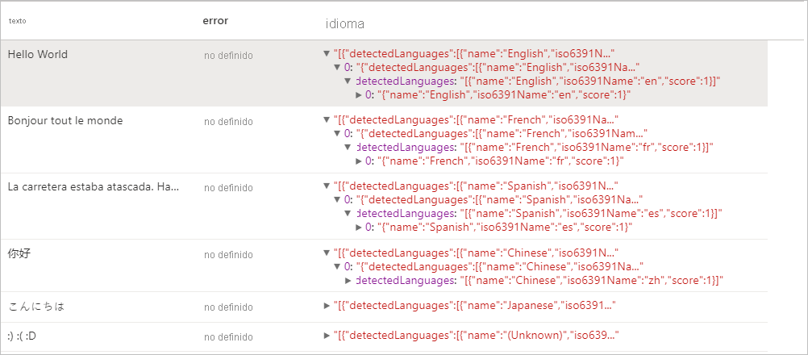
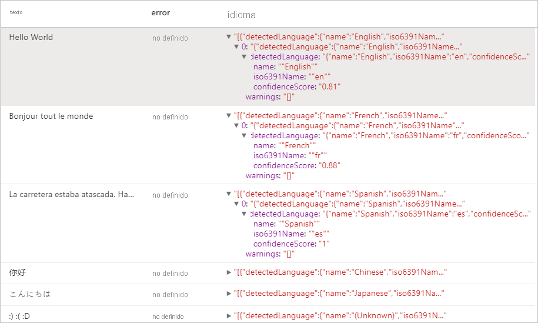
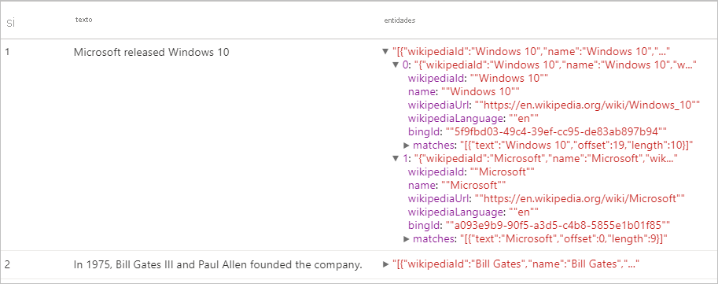
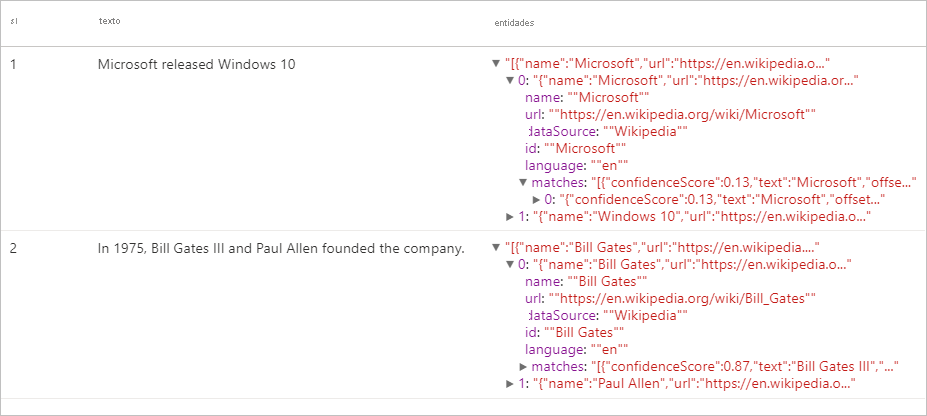
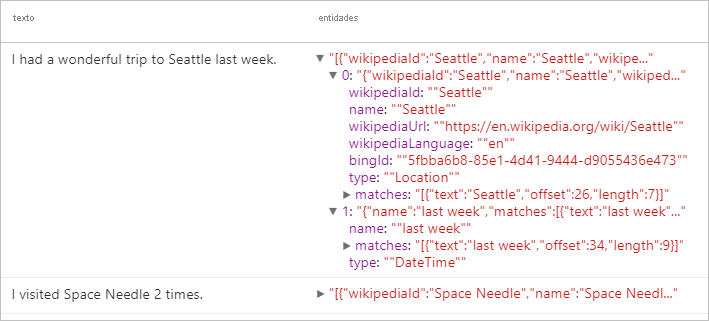
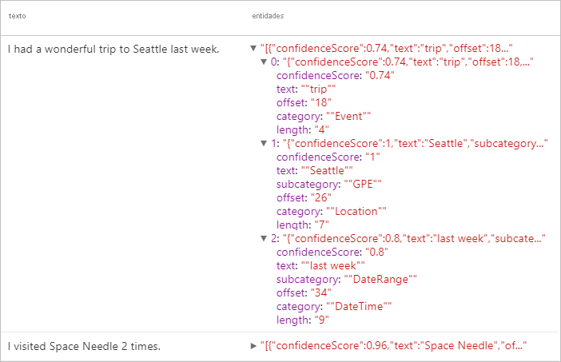
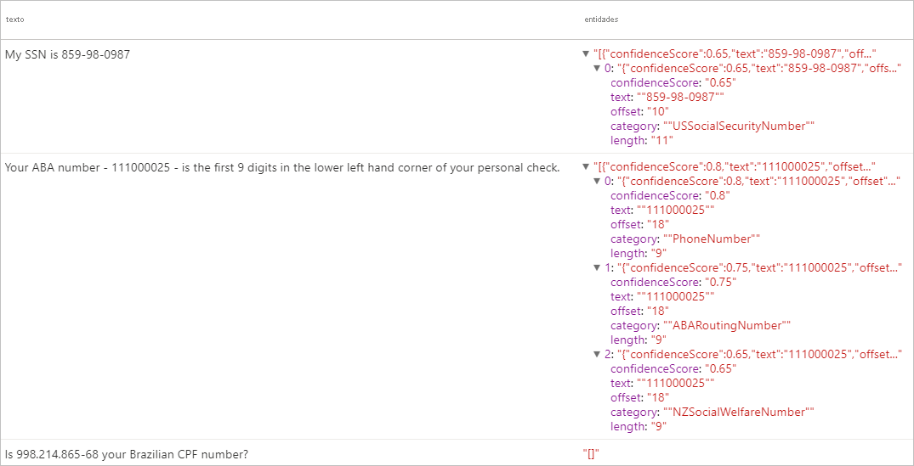

# <a name="tutorial-text-analytics-with-cognitive-service"></a>Tutorial: Text Analytics con Cognitive Service

[Text Analytics](../../cognitive-services/text-analytics/index.yml) es un componente de [Azure Cognitive Service](../../cognitive-services/index.yml) que permite efectuar tareas de minería y análisis de texto mediante características de procesamiento de lenguaje natural (NLP). En este tutorial, aprenderá a usar [Text Analytics](../../cognitive-services/text-analytics/index.yml) para analizar texto no estructurado en Azure Synapse Analytics.

En este tutorial se muestra cómo usar el análisis de textos con [SynapseML](https://github.com/microsoft/SynapseML) para:

> [!div class="checklist"]
> - Detectar etiquetas de opinión en el nivel de oración o documento
> - Identificar el idioma de una entrada de texto determinada
> - Reconocer entidades de un texto con vínculos a una base de conocimientos ya conocida
> - Extraer frases clave de un texto
> - Identificar distintas entidades del texto y clasificarlas en clases o tipos predefinidos
> - Identificar y censurar entidades confidenciales en un texto determinado

Si no tiene una suscripción a Azure, [cree una cuenta gratuita antes de empezar](https://azure.microsoft.com/free/).

## <a name="prerequisites"></a>Requisitos previos

- Necesitará un [área de trabajo de Azure Synapse Analytics](../get-started-create-workspace.md) con una cuenta de almacenamiento de Azure Data Lake Storage Gen2 que esté configurada como almacenamiento predeterminado. Asegúrese de que es el *colaborador de datos de Storage Blob* en el sistema de archivos de Data Lake Storage Gen2 con el que trabaja.
- Grupo de Spark en el área de trabajo de Azure Synapse Analytics. Para más información, consulte el artículo sobre [creación de un grupo de Spark en Azure Synapse](../quickstart-create-sql-pool-studio.md).
- Haber completado los pasos de configuración previos que se detallan en este tutorial sobre la [configuración de Cognitive Services en Azure Synapse](tutorial-configure-cognitive-services-synapse.md).


## <a name="get-started"></a>Introducción
Abra Synapse Studio y cree un nuevo cuaderno. Para empezar, importe [SynapseML](https://github.com/microsoft/SynapseML). 

```python
import synapse.ml
from synapse.ml.cognitive import *
from pyspark.sql.functions import col
```

## <a name="configure-text-analytics"></a>Configuración del análisis de texto

Use el análisis de texto vinculado que configuró en los [pasos de configuración previa](tutorial-configure-cognitive-services-synapse.md). 

```python
cognitive_service_name = "<Your linked service for text analytics>"
```

## <a name="text-sentiment"></a>Opinión de texto
El análisis de opinión de texto permite detectar las etiquetas de opinión (por ejemplo,"negativa", "neutra" y "positiva") y las puntuaciones de confianza en el nivel de oración y documento. Consulte los [idiomas admitidos en la APÌ Text Analytics](../../cognitive-services/text-analytics/language-support.md?tabs=sentiment-analysis) para obtener la lista de idiomas habilitados.

### <a name="v2"></a>V2

```python

# Create a dataframe that's tied to it's column names
df = spark.createDataFrame([
  ("I am so happy today, its sunny!", "en-US"),
  ("I am frustrated by this rush hour traffic", "en-US"),
  ("The cognitive services on spark aint bad", "en-US"),
], ["text", "language"])

# Run the Text Analytics service with options
sentimentv2 = (TextSentimentV2()
    .setLinkedService(linked_service_name)
    .setTextCol("text")
    .setOutputCol("sentiment")
    .setErrorCol("error")
    .setLanguageCol("language"))

# Show the results of your text query in a table format
display(sentimentv2.transform(df).select("text", col("sentiment")[0].getItem("score").alias("positive score")))

```
### <a name="expected-results"></a>Resultados esperados

|text|puntuación positiva|
|---|---|
|I am so happy today, its sunny!|0.99511755|
|I am frustrated by this rush hour traffic|0.007274598|
|The cognitive services on spark aint bad|0.9144157|

### <a name="v31"></a>V3.1

```python

# Create a dataframe that's tied to it's column names
df = spark.createDataFrame([
  ("I am so happy today, its sunny!", "en-US"),
  ("I am frustrated by this rush hour traffic", "en-US"),
  ("The cognitive services on spark aint bad", "en-US"),
], ["text", "language"])

# Run the Text Analytics service with options
sentiment = (TextSentiment()
    .setLinkedService(linked_service_name)
    .setTextCol("text")
    .setOutputCol("sentiment")
    .setErrorCol("error")
    .setLanguageCol("language"))

# Show the results of your text query in a table format
display(sentiment.transform(df).select("text", col("sentiment")[0].getItem("sentiment").alias("sentiment")))

```
### <a name="expected-results"></a>Resultados esperados

|text|opinión|
|---|---|
|I am so happy today, its sunny! (Hoy estoy muy feliz, el día está soleado)|positiva|
|I am frustrated by this rush hour traffic (Estoy frustrado por el tráfico de la hora punta)|negativa|
|The cognitive services on spark aint bad (Cognitive Services en Spark no está nada mal)|positiva|

---

## <a name="language-detector"></a>Detector de idioma

El detector de idioma evalúa la entrada de texto para cada documento y devuelve identificadores de idioma con una puntuación que indica la solidez análisis. Esta capacidad es útil para los almacenes de contenido que recopilan texto arbitrario, donde el idioma es desconocido. Consulte los [idiomas admitidos en la APÌ Text Analytics](../../cognitive-services/text-analytics/language-support.md?tabs=language-detection) para obtener la lista de idiomas habilitados.

### <a name="v2"></a>V2
```python
# Create a dataframe that's tied to it's column names
df = spark.createDataFrame([
  ("Hello World",),
  ("Bonjour tout le monde",),
  ("La carretera estaba atascada. Había mucho tráfico el día de ayer.",),
  ("你好",),
  ("こんにちは",),
  (":) :( :D",)
], ["text",])

# Run the Text Analytics service with options
languagev2 = (LanguageDetectorV2()
    .setLinkedService(linked_service_name)
    .setTextCol("text")
    .setOutputCol("language")
    .setErrorCol("error"))

# Show the results of your text query in a table format
display(languagev2.transform(df))
```
### <a name="expected-results"></a>Resultados esperados


### <a name="v31"></a>V3.1
```python
# Create a dataframe that's tied to it's column names
df = spark.createDataFrame([
  ("Hello World",),
  ("Bonjour tout le monde",),
  ("La carretera estaba atascada. Había mucho tráfico el día de ayer.",),
  ("你好",),
  ("こんにちは",),
  (":) :( :D",)
], ["text",])

# Run the Text Analytics service with options
language = (LanguageDetector()
    .setLinkedService(linked_service_name)
    .setTextCol("text")
    .setOutputCol("language")
    .setErrorCol("error"))

# Show the results of your text query in a table format
display(language.transform(df))
```
### <a name="expected-results"></a>Resultados esperados
<a name="expected-results-for-language-detector-v31"></a>
---

## <a name="entity-detector"></a>Detector de entidad
El detector de entidad devuelve una lista de entidades reconocidas con vínculos a una base de conocimientos ya conocida. Consulte los [idiomas admitidos en la APÌ Text Analytics](../../cognitive-services/text-analytics/language-support.md?tabs=entity-linking) para obtener la lista de idiomas habilitados.

### <a name="v2"></a>V2

```python
df = spark.createDataFrame([
    ("1", "Microsoft released Windows 10"),
    ("2", "In 1975, Bill Gates III and Paul Allen founded the company.")
], ["if", "text"])

entityv2 = (EntityDetectorV2()
    .setLinkedService(linked_service_name)
    .setLanguage("en")
    .setOutputCol("replies")
    .setErrorCol("error"))

display(entityv2.transform(df).select("if", "text", col("replies")[0].getItem("entities").alias("entities")))
```
### <a name="expected-results"></a>Resultados esperados



### <a name="v31"></a>V3.1

```python
df = spark.createDataFrame([
    ("1", "Microsoft released Windows 10"),
    ("2", "In 1975, Bill Gates III and Paul Allen founded the company.")
], ["if", "text"])

entity = (EntityDetector()
    .setLinkedService(linked_service_name)
    .setLanguage("en")
    .setOutputCol("replies")
    .setErrorCol("error"))

display(entity.transform(df).select("if", "text", col("replies")[0].getItem("entities").alias("entities")))
```
### <a name="expected-results"></a>Resultados esperados


---

## <a name="key-phrase-extractor"></a>Extracción de frases clave

La extracción de frases clave evalúa el texto no estructurado y devuelve una lista de frases clave. Esta capacidad es útil si necesita identificar rápidamente los principales puntos en una colección de documentos. Consulte los [idiomas admitidos en la APÌ Text Analytics](../../cognitive-services/text-analytics/language-support.md?tabs=key-phrase-extraction) para obtener la lista de idiomas habilitados.

### <a name="v2"></a>V2
```python
df = spark.createDataFrame([
    ("en", "Hello world. This is some input text that I love."),
    ("fr", "Bonjour tout le monde"),
    ("es", "La carretera estaba atascada. Había mucho tráfico el día de ayer.")
], ["lang", "text"])

keyPhrasesv2 = (KeyPhraseExtractorV2()
    .setLinkedService(linked_service_name)
    .setLanguageCol("lang")
    .setOutputCol("replies")
    .setErrorCol("error"))

display(keyPhrasesv2.transform(df).select("text", col("replies")[0].getItem("keyPhrases").alias("keyPhrases")))
```

### <a name="expected-results"></a>Resultados esperados

|text|keyPhrases|
|---|---|
|Hola mundo. Este es un texto de entrada que me encanta.|"["input text","world"]"|
|Bonjour tout le monde|"["monde"]"|
|La carretera estaba atascada. Había mucho tráfico el día de ayer.|"["carretera","tráfico","día"]"|


### <a name="v31"></a>V3.1

```python
df = spark.createDataFrame([
    ("en", "Hello world. This is some input text that I love."),
    ("fr", "Bonjour tout le monde"),
    ("es", "La carretera estaba atascada. Había mucho tráfico el día de ayer.")
], ["lang", "text"])

keyPhrase = (KeyPhraseExtractor()
    .setLinkedService(linked_service_name)
    .setLanguageCol("lang")
    .setOutputCol("replies")
    .setErrorCol("error"))

display(keyPhrase.transform(df).select("text", col("replies")[0].getItem("keyPhrases").alias("keyPhrases")))
```

### <a name="expected-results"></a>Resultados esperados

|text|keyPhrases|
|---|---|
|Hola mundo. Este es un texto de entrada que me encanta.|"["Hello world","input text"]"|
|Bonjour tout le monde|"["Bonjour","monde"]"|
|La carretera estaba atascada. Había mucho tráfico el día de ayer.|"["mucho tráfico","día","carretera","ayer"]"|

---

## <a name="named-entity-recognition-ner"></a>Reconocimiento de entidades con nombre (NER)

El reconocimiento de entidades con nombre (NER) es la capacidad para identificar diferentes entidades en el texto y clasificarlas en clases o tipos predefinidos, como: persona, ubicación, evento, producto y organización. Consulte los [idiomas admitidos en la APÌ Text Analytics](../../cognitive-services/text-analytics/language-support.md?tabs=named-entity-recognition) para obtener la lista de idiomas habilitados.

### <a name="v2"></a>V2
```python
df = spark.createDataFrame([
    ("1", "en", "I had a wonderful trip to Seattle last week."),
    ("2", "en", "I visited Space Needle 2 times.")
], ["id", "language", "text"])

nerv2 = (NERV2()
    .setLinkedService(linked_service_name)
    .setLanguageCol("language")
    .setOutputCol("replies")
    .setErrorCol("error"))

display(nerv2.transform(df).select("text", col("replies")[0].getItem("entities").alias("entities")))
```
### <a name="expected-results"></a>Resultados esperados


### <a name="v31"></a>V3.1

```python
df = spark.createDataFrame([
    ("1", "en", "I had a wonderful trip to Seattle last week."),
    ("2", "en", "I visited Space Needle 2 times.")
], ["id", "language", "text"])

ner = (NER()
    .setLinkedService(linked_service_name)
    .setLanguageCol("language")
    .setOutputCol("replies")
    .setErrorCol("error"))

display(ner.transform(df).select("text", col("replies")[0].getItem("entities").alias("entities")))
```
### <a name="expected-results"></a>Resultados esperados


---

## <a name="personally-identifiable-information-pii-v31"></a>Información de identificación personal (PII) V3.1
La característica PII forma parte de NER y puede identificar y suprimir entidades confidenciales en texto que están asociadas a una persona individual, como: el número de teléfono, la dirección de correo electrónico, la dirección de correo electrónico y el número de pasaporte. Consulte los [idiomas admitidos en la APÌ Text Analytics](../../cognitive-services/text-analytics/language-support.md?tabs=pii) para obtener la lista de idiomas habilitados.

### <a name="v31"></a>V3.1

```python
df = spark.createDataFrame([
    ("1", "en", "My SSN is 859-98-0987"),
    ("2", "en", "Your ABA number - 111000025 - is the first 9 digits in the lower left hand corner of your personal check."),
    ("3", "en", "Is 998.214.865-68 your Brazilian CPF number?")
], ["id", "language", "text"])

pii = (PII()
    .setLinkedService(linked_service_name)
    .setLanguageCol("language")
    .setOutputCol("replies")
    .setErrorCol("error"))

display(pii.transform(df).select("text", col("replies")[0].getItem("entities").alias("entities")))
```
### <a name="expected-results"></a>Resultados esperados


---

## <a name="clean-up-resources"></a>Limpieza de recursos
Para asegurarse de que se cierra la instancia de Spark, finalice todas las sesiones (cuadernos) conectadas. El grupo se cierra cuando se alcanza el **tiempo de inactividad** especificado en el grupo de Apache Spark. También puede decidir **finalizar la sesión** en la barra de estado en la parte superior derecha del cuaderno.


## <a name="next-steps"></a>Pasos siguientes

* [Consulte los cuadernos de ejemplo de Synapse](https://github.com/Azure-Samples/Synapse/tree/main/MachineLearning) 
* [Repositorio de GitHub de SynapseML](https://github.com/microsoft/SynapseML)
