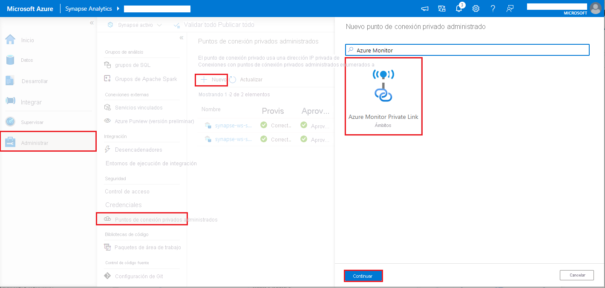

# <a name="monitor-apache-spark-applications-with-azure-log-analytics-preview"></a>Supervisión de las aplicaciones de Apache Spark con Azure Log Analytics (versión preliminar)

En este tutorial, aprenderá a habilitar el conector Synapse Studio integrado en Log Analytics. Luego, puede recopilar y enviar los registros y las métricas de aplicación de Apache Spark al [área de trabajo de Log Analytics](../../azure-monitor/logs/quick-create-workspace.md). Finalmente, puede aprovechar los libros de Azure Monitor para visualizar las métricas y los registros.

## <a name="configure-workspace-information"></a>Configuración de la información del área de trabajo

Siga estos pasos para configurar la información necesaria en Synapse Studio.

### <a name="step-1-create-a-log-analytics-workspace"></a>Paso 1: Creación de un área de trabajo de Log Analytics

Consulte uno de los siguientes recursos para crear este área de trabajo:
- [Creación de un área de trabajo en Azure Portal](../../azure-monitor/logs/quick-create-workspace.md)
- [Creación de un área de trabajo con la CLI de Azure](../../azure-monitor/logs/quick-create-workspace-cli.md)
- [Creación y configuración de un área de trabajo en Azure Monitor con PowerShell](../../azure-monitor/logs/powershell-workspace-configuration.md)

### <a name="step-2-prepare-a-apache-spark-configuration-file"></a>Paso 2: Preparación de un archivo de configuración de Apache Spark

Use cualquiera de las siguientes opciones para preparar el archivo.

#### <a name="option-1-configure-with-log-analytics-workspace-id-and-key"></a>Opción 1: Configuración con el identificador y la clave del área de trabajo de Log Analytics 

Copie la siguiente configuración de Apache Spark, guárdela como *spark_loganalytics_conf.txt* y rellene los siguientes parámetros:

   - `<LOG_ANALYTICS_WORKSPACE_ID>`: identificador del área de trabajo de Log Analytics.
   - `<LOG_ANALYTICS_WORKSPACE_KEY>`: clave de Log Analytics. Para encontrarla, en Azure Portal, vaya a **Área de trabajo de Azure Log Analytics** > **Administración de agentes** > **Clave principal**.

```properties
spark.synapse.logAnalytics.enabled true
spark.synapse.logAnalytics.workspaceId <LOG_ANALYTICS_WORKSPACE_ID>
spark.synapse.logAnalytics.secret <LOG_ANALYTICS_WORKSPACE_KEY>
```

#### <a name="option-2-configure-with-azure-key-vault"></a>Opción 2: Configuración con Azure Key Vault

> [!NOTE]
> Debe conceder permiso de lectura de secretos a los usuarios que vayan a enviar aplicaciones Apache Spark. Para más información, consulte [Acceso a las claves, los certificados y los secretos de Key Vault con un control de acceso basado en rol de Azure](../../key-vault/general/rbac-guide.md).

Para configurar Azure Key Vault para almacenar la clave del área de trabajo, siga estos pasos:

1. Cree un almacén de claves en Azure Portal y desplácese hasta él.
2. En la página de configuración del almacén de claves, seleccione **Secretos**.
3. Seleccione **Generar o importar**.
4. En la pantalla **Crear un secreto**, elija los siguientes valores:
   - **Nombre**: escriba un nombre para el secreto. Como valor predeterminado, escriba `SparkLogAnalyticsSecret`.
   - **Valor**: escriba el valor de `<LOG_ANALYTICS_WORKSPACE_KEY>` del secreto.
   - Deje las restantes opciones con sus valores predeterminados. Seleccione **Crear**.
5. Copie la siguiente configuración de Apache Spark, guárdela como *spark_loganalytics_conf.txt* y rellene los siguientes parámetros:

   - `<LOG_ANALYTICS_WORKSPACE_ID>`: identificador del área de trabajo de Log Analytics.
   - `<AZURE_KEY_VAULT_NAME>`: el nombre del almacén de claves que configuró.
   - `<AZURE_KEY_VAULT_SECRET_KEY_NAME>` (opcional): el nombre del secreto en el almacén de claves para la clave del área de trabajo. El valor predeterminado es `SparkLogAnalyticsSecret`.

```properties
spark.synapse.logAnalytics.enabled true
spark.synapse.logAnalytics.workspaceId <LOG_ANALYTICS_WORKSPACE_ID>
spark.synapse.logAnalytics.keyVault.name <AZURE_KEY_VAULT_NAME>
spark.synapse.logAnalytics.keyVault.key.secret <AZURE_KEY_VAULT_SECRET_KEY_NAME>
```

> [!NOTE]
> También puede almacenar el identificador del área de trabajo en Key Vault. Consulte los pasos anteriores y almacene el identificador del área de trabajo con el nombre del secreto `SparkLogAnalyticsWorkspaceId`. Como alternativa, puede usar la configuración `spark.synapse.logAnalytics.keyVault.key.workspaceId` para especificar el nombre del secreto del identificador del área de trabajo en Key Vault.

#### <a name="option-3-configure-with-a-linked-service"></a>Opción 3. Configuración con un servicio vinculado

> [!NOTE]
> Debe conceder permiso de lectura de secretos a los usuarios que vayan a enviar aplicaciones Apache Spark. Para más información, consulte [Acceso a las claves, los certificados y los secretos de Key Vault con un control de acceso basado en rol de Azure](../../key-vault/general/rbac-guide.md).

Para configurar un servicio vinculado de Key Vault en Synapse Studio para almacenar la clave del área de trabajo, siga estos pasos:

1. Siga todos los pasos de la sección anterior, "Opción 2".
2. Cree un servicio vinculado de Key Vault en Synapse Studio:

    a. Vaya a **Synapse Studio** > **Administrar** > **Servicios vinculados** y seleccione **Nuevo**.

    b. Busque **Azure Key Vault** en el cuadro de búsqueda.

    c. Escriba un nombre para el servicio vinculado.

    d. Elija su almacén de claves y seleccione **Crear**.

3. Agregue un elemento `spark.synapse.logAnalytics.keyVault.linkedServiceName` a la configuración de Apache Spark.

```properties
spark.synapse.logAnalytics.enabled true
spark.synapse.logAnalytics.workspaceId <LOG_ANALYTICS_WORKSPACE_ID>
spark.synapse.logAnalytics.keyVault.name <AZURE_KEY_VAULT_NAME>
spark.synapse.logAnalytics.keyVault.key.secret <AZURE_KEY_VAULT_SECRET_KEY_NAME>
spark.synapse.logAnalytics.keyVault.linkedServiceName <LINKED_SERVICE_NAME>
```

#### <a name="available-apache-spark-configuration"></a>Configuración disponible de Apache Spark

| Nombre de la configuración | Valor predeterminado | Descripción |
| ------------------ | ------------- | ----------- |
| spark.synapse.logAnalytics.enabled | false | True para habilitar el receptor de Log Analytics para las aplicaciones Spark. En caso contrario, es false. |
| spark.synapse.logAnalytics.workspaceId | - | Identificador del área de trabajo de Log Analytics de destino. |
| spark.synapse.logAnalytics.secret | - | Secreto del área de trabajo de Log Analytics de destino. |
| spark.synapse.logAnalytics.keyVault.linkedServiceName   | - | Nombre del servicio vinculado de Key Vault para el identificador y la clave del área de trabajo de Log Analytics. |
| spark.synapse.logAnalytics.keyVault.name | - | Nombre del almacén de claves para el identificador y la clave de Log Analytics. |
| spark.synapse.logAnalytics.keyVault.key.workspaceId | SparkLogAnalyticsWorkspaceId | Nombre del secreto de Key Vault para el identificador del área de trabajo de Log Analytics. |
| spark.synapse.logAnalytics.keyVault.key.secret | SparkLogAnalyticsSecret | Nombre del secreto de Key Vault para el área de trabajo de Log Analytics |
| spark.synapse.logAnalytics.uriSuffix | ods.opinsights.azure.com | [Sufijo de URI][uri_suffix] del área de trabajo de Log Analytics de destino. Si el área de trabajo no está en Azure global, debe actualizar el sufijo del URI de acuerdo con la nube correspondiente. |
| spark.synapse.logAnalytics.filter.eventName.match | - | Opcional. Nombres de eventos de Spark separados por comas, puede especificar qué eventos se recopilan. Por ejemplo: `SparkListenerJobStart,SparkListenerJobEnd` |
| spark.synapse.logAnalytics.filter.loggerName.match | - | Opcional. Nombres del registrador log4j separados por comas, puede especificar qué registros se recopilan. Por ejemplo: `org.apache.spark.SparkContext,org.example.Logger` |
| spark.synapse.logAnalytics.filter.metricName.match | - | Opcional. Sufijos de nombre de métrica de Spark separados por comas, puede especificar qué métricas se recopilan. Por ejemplo: `jvm.heap.used`|

> [!NOTE]  
> - En Azure China, el parámetro `spark.synapse.logAnalytics.uriSuffix` debe ser `ods.opinsights.azure.cn`. 
> - En Azure Government, el parámetro `spark.synapse.logAnalytics.uriSuffix` debe ser `ods.opinsights.azure.us`. 

[uri_suffix]: ../../azure-monitor/logs/data-collector-api.md#request-uri


### <a name="step-3-upload-your-apache-spark-configuration-to-a-apache-spark-pool"></a>Paso 3: Carga de la configuración de Apache Spark en un grupo de Apache Spark
Puede cargar el archivo de configuración en el grupo de Apache Spark de Azure Synapse Analytics. En Synapse Studio:

   1. Seleccione **Administrar** > **Grupos de Apache Spark**.
   2. Junto al grupo de Apache Spark, seleccione el botón **...** .
   3. Seleccione **Apache Spark configuration** (Configuración de Apache Spark). 
   4. Seleccione **Cargar** y elija el archivo *spark_loganalytics_conf.txt*.
   5. Seleccione **Cargar** y, luego, elija **Aplicar**.

      > [!div class="mx-imgBorder"]
      > 

> [!NOTE] 
>
> Todas las aplicaciones Apache Spark que se envíen al grupo de Apache Spark usarán los valores de configuración para insertar las métricas y los registros de las aplicaciones Apache Spark en el área de trabajo especificada.

## <a name="submit-a-apache-spark-application-and-view-the-logs-and-metrics&quot;></a>Envío de una aplicación Apache Spark y visualización de los registros y métricas

A continuación se muestra cómo hacerlo:

1. Envíe una aplicación Apache Spark al grupo de Apache Spark configurado en el paso anterior. Para ello, puede usar cualquiera de los siguientes métodos:
    - Ejecutar un cuaderno en Synapse Studio. 
    - En Synapse Studio, envíe un trabajo por lotes de Apache Spark mediante una definición de trabajo de Apache Spark.
    - Ejecute una canalización que contenga la actividad de Apache Spark.

1. Vaya al área de trabajo de Log Analytics especificada y, luego, vea las métricas y los registros de la aplicación cuando la aplicación Apache Spark empiece a ejecutarse.

## <a name=&quot;write-custom-application-logs&quot;></a>Escritura de registros de aplicaciones personalizados

Puede usar la biblioteca Log4j de Apache para escribir registros personalizados.

Ejemplo de Scala:

```scala
%%spark
val logger = org.apache.log4j.LogManager.getLogger(&quot;com.contoso.LoggerExample")
logger.info("info message")
logger.warn("warn message")
logger.error("error message")
```

Ejemplo de PySpark:

```python
%%pyspark
logger = sc._jvm.org.apache.log4j.LogManager.getLogger("com.contoso.PythonLoggerExample")
logger.info("info message")
logger.warn("warn message")
logger.error("error message")
```

## <a name="use-the-sample-workbook-to-visualize-the-metrics-and-logs"></a>Uso del libro de ejemplo para visualizar las métricas y los registros

1. [Descargue el libro](https://aka.ms/SynapseSparkLogAnalyticsWorkbook).
2. Abra y copie el contenido del archivo de libro.
3. En [Azure Portal](https://portal.azure.com/), seleccione **Área de trabajo de Log Analytics** > **Libros**. 
4. Abra el libreo **Vacío**. Use el modo **Editor avanzado** mediante la selección del icono **</>** .
5. Pegue el código JSON que exista.
6. Seleccione **Aplicar** y, luego, **Edición finalizada**.

    > [!div class="mx-imgBorder"]
    > 

    > [!div class="mx-imgBorder"]
    > 

A continuación, envíe la aplicación Apache Spark al grupo de Apache Spark configurado. Cuando la aplicación pase al estado de ejecución, elija la aplicación en ejecución en la lista desplegable de libros.

> [!div class="mx-imgBorder"]
> 

Puede personalizar el libro. Por ejemplo, puede usar consultas de Kusto y configurar alertas.

> [!div class="mx-imgBorder"]
> 

## <a name="query-data-with-kusto"></a>Consulta de datos con Kusto

Este es un ejemplo de consulta de eventos de Apache Spark:

```kusto
SparkListenerEvent_CL
| where workspaceName_s == "{SynapseWorkspace}" and clusterName_s == "{SparkPool}" and livyId_s == "{LivyId}"
| order by TimeGenerated desc
| limit 100 
```

Este es un ejemplo de consulta de los registros de ejecutores y del controlador de aplicación de Apache Spark:

```kusto
SparkLoggingEvent_CL
| where workspaceName_s == "{SynapseWorkspace}" and clusterName_s == "{SparkPool}" and livyId_s == "{LivyId}"
| order by TimeGenerated desc
| limit 100
```

Y este es un ejemplo de consulta de métricas de Apache Spark:

```kusto
SparkMetrics_CL
| where workspaceName_s == "{SynapseWorkspace}" and clusterName_s == "{SparkPool}" and livyId_s == "{LivyId}"
| where name_s endswith "jvm.total.used"
| summarize max(value_d) by bin(TimeGenerated, 30s), executorId_s
| order by TimeGenerated asc
```


## <a name="create-and-manage-alerts"></a>Creación y administración de alertas

Los usuarios pueden realizar consultas para evaluar las métricas y los registros según una frecuencia establecida y activar una alerta en función de los resultados. Para más información, consulte [Creación, visualización y administración de alertas de registro mediante Azure Monitor](../../azure-monitor/alerts/alerts-log.md).

## <a name="synapse-workspace-with-data-exfiltration-protection-enabled"></a>Área de trabajo de Synapse con la protección de datos contra la filtración habilitada

Después de crear el área de trabajo de Synapse con la [protección contra la filtración de datos](../security/workspace-data-exfiltration-protection.md) habilitada.

Cuando quiera habilitar esta característica, tiene que crear solicitudes de conexión de puntos de conexión privados administrados a [Ámbitos de Private Link de Azure Monitor (AMPLS)](../../azure-monitor/logs/private-link-security.md) en los inquilinos de Azure AD aprobados del área de trabajo.

Puede seguir los pasos a continuación para crear una conexión de punto de conexión privado administrado a Ámbitos de Private Link de Azure Monitor (AMPLS):

1. Si no existe ningún AMPLS, siga la [Configuración de una conexión de Private Link de Azure Monitor](../../azure-monitor/logs/private-link-security.md) para crear uno.
2. Vaya a su AMPLS en Azure Portal, en la página **Recursos de Azure Monitor**, haga clic en **Agregar** para agregar la conexión al área de trabajo de Azure Log Analytics.
3. Vaya a **Synapse Studio > Administrar > Managed private endpoints** (Puntos de conexión privados administrados), haga clic en el botón **Nuevo**, seleccione **Azure Monitor Private Link Scopes** (Ámbitos de Private Link de Azure Monitor) y **Continuar**.
   > [!div class="mx-imgBorder"]
   > 
4. Elija el ámbito de Private Link de Azure Monitor que acaba de crear y haga clic en el botón **Crear**.
   > [!div class="mx-imgBorder"]
   > 
5. Espere unos minutos durante el aprovisionamiento del punto de conexión privado.
6. Vuelva a su AMPLS en Azure Portal; en la página **Conexiones de punto de conexión privado**, seleccione la conexión que acaba de aprovisionar y seleccione **Aprobar**.

> [!NOTE] 
>  - El objeto de AMPLS tiene una serie de límites que se deben tener en cuenta al planear la configuración de Private Link. Consulte [Límites de AMPLS](../../azure-monitor/logs/private-link-security.md) para un análisis más detallado de estos límites. 
>  - Compruebe si tiene el [permiso adecuado](../security/synapse-workspace-access-control-overview.md) para crear un punto de conexión privado administrado.

## <a name="next-steps"></a>Pasos siguientes

 - [Use un grupo de Apache Spark sin servidor en Synapse Studio](../quickstart-create-apache-spark-pool-studio.md).
 - [Ejecute una aplicación Spark en un cuaderno](./apache-spark-development-using-notebooks.md).
 - [Cree una definición de trabajo de Apache Spark en Azure Studio](./apache-spark-job-definitions.md).
 - [Recopilación de métricas y registros de aplicaciones de Apache Spark con una cuenta de Azure Storage](./azure-synapse-diagnostic-emitters-azure-storage.md)
 - [Recopilación de métricas y registros de aplicaciones de Apache Spark con Azure Event Hubs](./azure-synapse-diagnostic-emitters-azure-eventhub.md)
