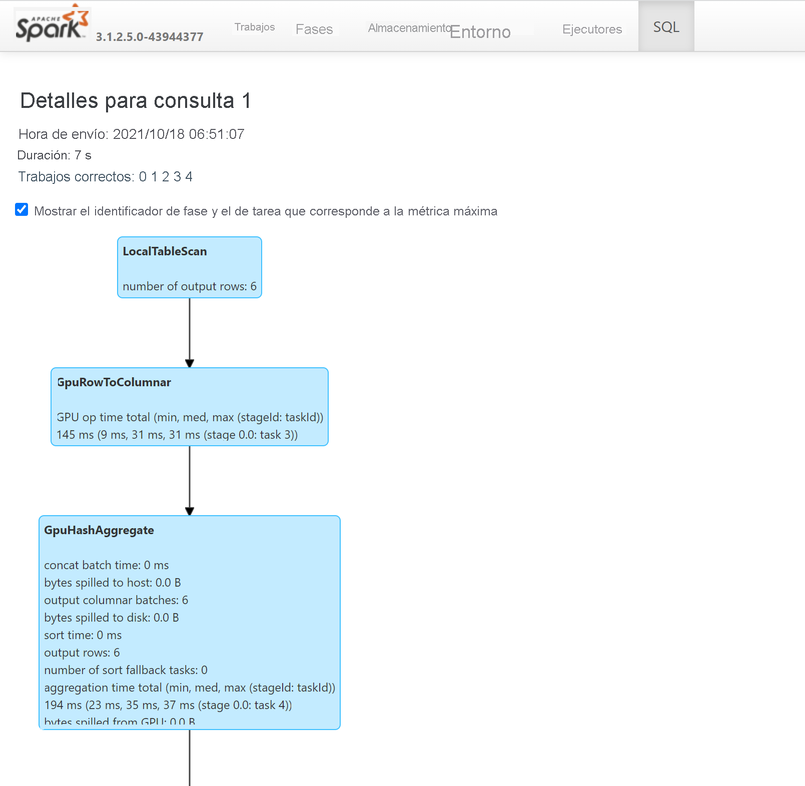

# <a name="apache-spark-gpu-accelerated-pools-in-azure-synapse-analytics"></a>Grupos de Apache Spark acelerados por GPU en Azure Synapse Analytics

Apache Spark es una plataforma de procesamiento paralelo que admite el procesamiento en memoria para mejorar el rendimiento de aplicaciones de análisis de macrodatos. Apache Spark en Azure Synapse Analytics es una de las implementaciones de Microsoft de Apache Spark en la nube. 

Azure Synapse ahora ofrece la capacidad de crear grupos habilitados para GPU de Azure Synapse para ejecutar cargas de trabajo de Spark mediante [bibliotecas de RAPIDS](https://nvidia.github.io/spark-rapids/) subyacentes que utilizan la enorme potencia de procesamiento paralelo de las GPU para acelerar el procesamiento. El acelerador RAPIDS para Apache Spark permite ejecutar las aplicaciones de Spark existentes **sin ningún cambio de código** mediante la habilitación de una opción de configuración, que viene preconfigurada para un grupo habilitado para GPU.
Puede optar por activar o desactivar la aceleración de GPU basada en RAPIDS para la carga de trabajo, o partes de ella, estableciendo esta configuración:

```
spark.conf.set('spark.rapids.sql.enabled','true/false')
```

> [!NOTE]
> Los grupos habilitados para GPU de Azure Synapse están actualmente en versión preliminar pública.

## <a name="rapids-accelerator-for-apache-spark"></a>Acelerador RAPIDS para Apache Spark

El acelerador RAPIDS para Spark es un complemento que funciona invalidando el plan físico de un trabajo de Spark mediante operaciones de GPU admitidas y ejecutando esas operaciones en las GPU, lo que acelera el procesamiento. Esta biblioteca se encuentra actualmente en versión preliminar y no admite todas las operaciones de Spark (esta es una lista de los [operadores que se admiten actualmente](https://nvidia.github.io/spark-rapids/docs/supported_ops.html) y se agregará más compatibilidad incrementalmente a través de nuevas versiones).

## <a name="cluster-configuration-options"></a>Opciones de configuración del clúster

El complemento Acelerador RAPIDS solo admite una asignación uno a uno entre GPU y ejecutores, lo que significa que un trabajo de Spark tendría que solicitar recursos de ejecutor y de controlador a los que los recursos del grupo puedan alojar (en función del número de núcleos de CPU y GPU disponibles). Para cumplir esta condición y garantizar el uso óptimo de todos los recursos del grupo, se requiere la siguiente configuración de los controladores y ejecutores en una aplicación de Spark que se ejecuta en grupos habilitados para GPU:


|Tamaño del grupo | Opciones de tamaño del controlador | Núcleos de controlador | Memoria del controlador (GB) | Núcleos del ejecutor | Memoria del ejecutor (GB) | Número de ejecutores |
| :------ | :-------------- | :---------- | :------------- | :------------- | :------------------- | :------------------ |
| GPU grande | Controlador pequeño | 4 | 30 | 12 | 60 | Número de nodos en el grupo |
| GPU grande | Controlador medio | 7 | 30 | 9 | 60 | Número de nodos en el grupo |
| GPU extra grande | Controlador medio | 8 | 40 | 14 | 80 | 4 * Número de nodos en el grupo |
| GPU extra grande | Controlador grande | 12 | 40 | 13 | 80 | 4 * Número de nodos en el grupo |


No se aceptará ninguna carga de trabajo que no cumpla una de las configuraciones anteriores. Esto se hace para asegurarse de que los trabajos de Spark se ejecutan con la configuración más eficaz mediante todos los recursos disponibles en el grupo.

El usuario puede establecer la configuración anterior a través de su carga de trabajo. En el caso de los cuadernos, el usuario puede utilizar el comando magic `%%configure` para establecer una de las configuraciones anteriores, como se muestra a continuación.
Por ejemplo, mediante un grupo grande con tres nodos:

```
%%configure -f
{
    "driverMemory": "30g",
    "driverCores": 4,
    "executorMemory": "60g",
    "executorCores": 12,
    "numExecutors": 3
}
```

## <a name="run-a-sample-spark-job-through-notebook-on-an-azure-synapse-gpu-accelerated-pool"></a>Ejecución de un trabajo de Spark de ejemplo a través de un cuaderno en un grupo acelerado por GPU de Azure Synapse

Sería conveniente conocer los [conceptos básicos de cómo usar los cuadernos](apache-spark-development-using-notebooks.md) en Azure Synapse Analytics antes de continuar con esta sección. Vamos a seguir los pasos necesarios para ejecutar una aplicación de Spark que utiliza la aceleración de GPU. Puede escribir una aplicación Spark en los cuatro lenguajes admitidos en Synapse: PySpark (Python), Spark (Scala), SparkSQL y .NET para Spark (C#).

1. Cree un grupo habilitado para GPU como se describe en [este inicio rápido](../quickstart-create-apache-gpu-pool-portal.md).

2. Cree un cuaderno y adjúntelo al grupo habilitado para GPU que creó en el primer paso.

3. Establezca las configuraciones como se explicó en la sección anterior.

4. Cree un dataframe de ejemplo, para lo que debe copiar el código siguiente en la primera celda del cuaderno:

### <a name="scala"></a>[Scala](#tab/scala)

```scala
import org.apache.spark.sql.types.{IntegerType, StringType, StructField, StructType}
import org.apache.spark.sql.Row
import scala.collection.JavaConversions._

val schema = StructType( Array(
  StructField("emp_id", IntegerType),
  StructField("name", StringType),
  StructField("emp_dept_id", IntegerType),
  StructField("salary", IntegerType)
))

val emp = Seq(Row(1, "Smith", 10, 100000),
    Row(2, "Rose", 20, 97600),
    Row(3, "Williams", 20, 110000),
    Row(4, "Jones", 10, 80000),
    Row(5, "Brown", 40, 60000),
    Row(6, "Brown", 30, 78000)
  )

val empDF = spark.createDataFrame(emp, schema)
```

### <a name="python"></a>[Python](#tab/python)

```python
emp = [(1, "Smith", 10, 100000),
    (2, "Rose", 20, 97600),
    (3, "Williams", 20, 110000),
    (4, "Jones", 10, 80000),
    (5, "Brown", 40, 60000),
    (6, "Brown", 30, 78000)]

empColumns = ["emp_id", "name", "emp_dept_id", "salary"]

empDF = spark.createDataFrame(data=emp, schema=empColumns)
```

### <a name="c"></a>[C#](#tab/csharp)

```csharp
using Microsoft.Spark.Sql.Types;

var emp = new List<GenericRow>
{
    new GenericRow(new object[] { 1, "Smith", 10, 100000 }),
    new GenericRow(new object[] { 2, "Rose", 20, 97600 }),
    new GenericRow(new object[] { 3, "Williams", 20, 110000 }),
    new GenericRow(new object[] { 4, "Jones", 10, 80000 }),
    new GenericRow(new object[] { 5, "Brown", 40, 60000 }),
    new GenericRow(new object[] { 6, "Brown", 30, 78000 })
};

var schema = new StructType(new List<StructField>()
{
    new StructField("emp_id", new IntegerType()),
    new StructField("name", new StringType()),
    new StructField("emp_dept_id", new IntegerType()),
    new StructField("salary", new IntegerType())
});

DataFrame empDF = spark.CreateDataFrame(emp, schema);
```
---

5. Ahora vamos a hacer un agregado obteniendo el sueldo máximo por identificador de departamento y a mostrar el resultado:

### <a name="scala"></a>[Scala](#tab/scala1)

```scala
val resultDF = empDF.groupBy("emp_dept_id").max("salary")
resultDF.show()
```

### <a name="python"></a>[Python](#tab/python1)

```python
resultDF = empDF.groupBy("emp_dept_id").max("salary")
resultDF.show()
```

### <a name="c"></a>[C#](#tab/csharp1)

```csharp
DataFrame resultDF = empDF.GroupBy("emp_dept_id").Max("salary");
resultDF.Show();
```
---

6. Para ver las operaciones de la consulta que se ejecutaron en GPU, consulte el plan de SQL a través del servidor de historial de Spark: 

## <a name="how-to-tune-your-application-for-gpus"></a>Ajuste de una aplicación para las GPU

En la mayoría de los trabajos de Spark, el rendimiento puede mejorar si se ajusta su configuración cambiando los valores predeterminados, y lo mismo se aplica a los trabajos que aprovechan el complemento del acelerador RAPIDS para Apache Spark. En [esta documentación](https://nvidia.github.io/spark-rapids/docs/tuning-guide.html) se proporcionan instrucciones sobre cómo ajustar cualquier trabajo de Spark para que se ejecute en GPU mediante el complemento RAPIDS.

## <a name="quotas-and-resource-constraints-in-azure-synapse-gpu-enabled-pools"></a>Cuotas y restricciones de recursos en los grupos habilitados para GPU de Azure Synapse

### <a name="workspace-level"></a>Nivel de área de trabajo

Cada área de trabajo de Azure Synapse incluye una cuota predeterminada de 50 núcleos virtuales de GPU. Para aumentar la cuota de núcleos de GPU, envíe un correo electrónico a AzureSynapseGPU@microsoft.com con el nombre del área de trabajo, la región y la cuota total de GPU necesaria para la carga de trabajo.

## <a name="next-steps"></a>Pasos siguientes
- [Azure Synapse Analytics](../overview-what-is.md)
