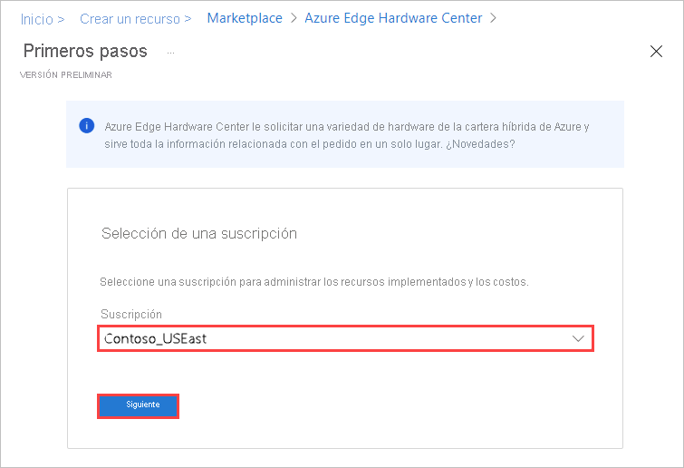
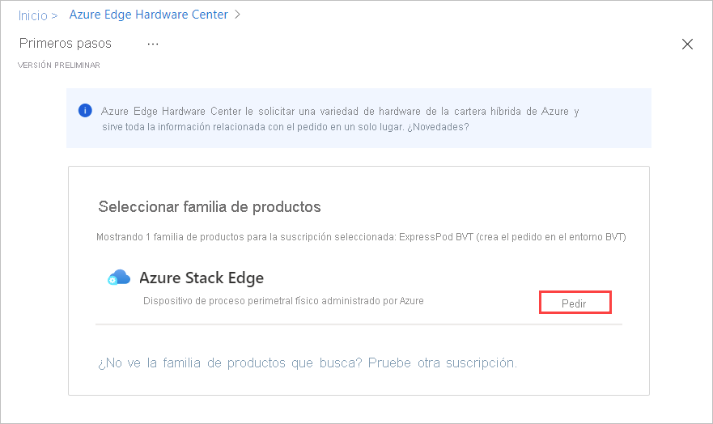
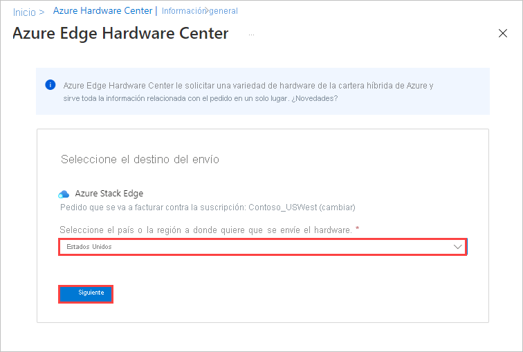
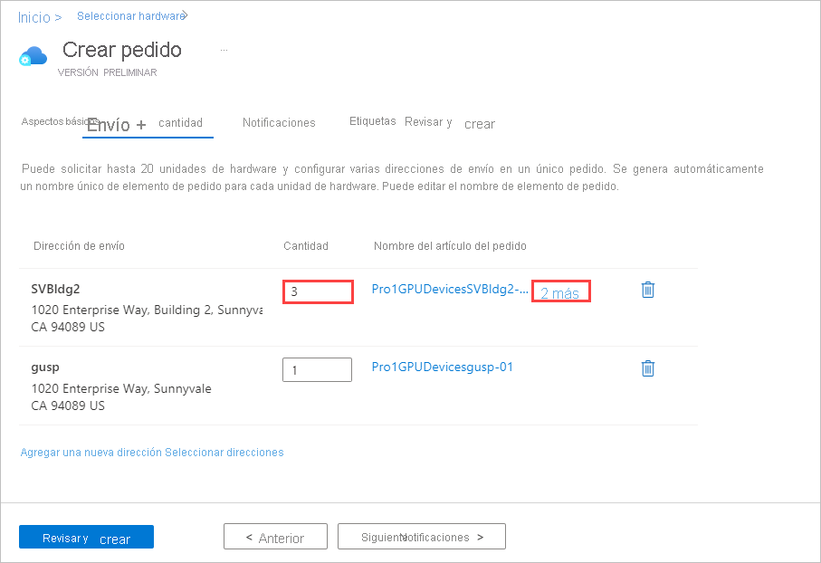
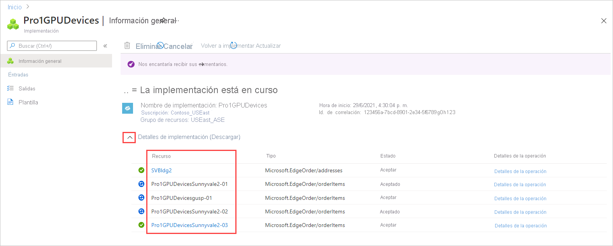

Para realizar un pedido a través de Azure Edge Hardware Center, siga estos pasos:

1. Use sus credenciales de Microsoft Azure para iniciar sesión en Azure Portal, en esta dirección URL: [https://portal.azure.com](https://portal.azure.com).

2. Seleccione **+ Crear un recurso**. Busque y seleccione **Azure Edge Hardware Center**. En Azure Edge Hardware Center, seleccione **Crear**.

    

3. Elija una suscripción y seleccione **Siguiente**.

    

4. Para iniciar el pedido, seleccione **Pedido** junto a la familia de productos que quiere solicitar, por ejemplo, **Azure Stack Edge**. Si no ve la familia de productos, es posible que tenga que utilizar otra suscripción; seleccione **Pruebe a seleccionar otra suscripción**. 

     

5. Seleccione el destino de envío del pedido.

    

6. En la página **Seleccionar hardware**, utilice el botón **Seleccionar** para elegir el producto de hardware que quiere pedir. Por ejemplo, seleccione **Azure Stack Edge Pro: GPU**. 

    

    Después de seleccionar un producto de hardware, seleccionará la configuración del dispositivo que se va a solicitar. Los siguientes productos de hardware y configuraciones de dispositivos están disponibles en Azure Edge Hardware Center (versión preliminar).

    |Producto de hardware              |Configuraciones                                                                                              |
    |------------------------------|------------------------------------------------------------------------------------------------------------|
    |Azure Stack Edge Pro: GPU    |<ul><li>Azure Stack Edge Pro: 1 GPU</li><li>Azure Stack Edge Pro: 2 GPU</li><ul>                          |
    |Azure Stack Edge Pro R        |<ul><li>Azure Stack Edge Pro R: nodo único</li><li>Azure Stack Edge Pro R: nodo único con UPS</li></ul>|
    |Azure Stack Edge Mini R       |Una configuración; se selecciona automáticamente.                 |

7. Seleccione la configuración del dispositivo y, a continuación, elija **Seleccionar**. En la pantalla siguiente se muestran las configuraciones disponibles para los dispositivos Azure Stack Edge Pro: GPU.

    Si solicita dispositivos Azure Stack Edge Mini R, que tienen la misma configuración, no verá esta pantalla. 

    

    Se abrirá el Asistente para **crear pedidos**.

8.  En la pestaña **Aspectos básicos**, indique el **nombre de un pedido**, el **grupo de recursos** y la **región**. Luego, seleccione **Next: Shipping + quantity >** (Siguiente: Envío y cantidad >).

    
  
    A continuación, agregará cada dirección de envío a la que quiere enviar dispositivos y, a continuación, especificará cuántos dispositivos se enviarán a cada dirección. Puede pedir un total de 20 unidades (dispositivos) por pedido.

9. En la pestaña **Shipping + quantity** (Envío y cantidad), agregue todas las direcciones de envío a las que se deben enviar los dispositivos: 

    - Para agregar una nueva dirección de envío, seleccione **Agregar una nueva dirección**. 

       El campo obligatorio **Alias de dirección** de la pantalla **Nueva dirección** identifica la dirección para su uso posterior. Cuando acabe de rellenar los campos de dirección, seleccione **Agregar**. A continuación, use **Seleccionar direcciones** para agregar la dirección al pedido.

       

    - Para usar una dirección de envío de un pedido anterior, o para utilizar una dirección que acaba de agregar, seleccione **Select address(es)** (Seleccionar direcciones). A continuación, en la pantalla **Select address(es)** (Seleccionar direcciones), seleccione una o varias direcciones y elija **Seleccionar**.

       

    La pestaña **Shipping + quantity** (Envío y cantidad) ahora tiene un elemento independiente para cada dirección de envío.

    Todos los nombres de artículos del pedido incluyen un prefijo de nombre (el nombre del pedido seguido del alias de la dirección), con un número de artículo para cada dispositivo que se envía a esa dirección.

    

10. Para cada dirección, introduzca la **cantidad** de dispositivos que se deben enviar en la pestaña **Shipping + quantity** (Envío y cantidad).

    Cuando se introduce una cantidad superior a uno, aparece la etiqueta **+n more** (+n más) después del nombre del artículo del pedido.

     

11. Si quiere cambiar los nombres de los artículos del pedido, seleccione el nombre del artículo del pedido y haga clic en él para abrir el panel **Cambiar el nombre del artículo del pedido**. Si va a enviar más de un artículo a una dirección, seleccione **+n more** (+n más).

    Puede realizar dos tipos de cambio de nombre:
 
    * Para usar otro prefijo de nombre para todos los artículos del pedido, edite el **prefijo de nombre** y, a continuación, seleccione **Aplicar**, como se muestra en la pantalla siguiente.

    * También puede editar el nombre de cada artículo del pedido de forma individual. 

    Cuando termine, seleccione **Guardar**.

    

    Seleccione **Next: Notifications >** (Siguiente: Notificaciones >) para continuar.

12. Si quiere recibir notificaciones de estado a medida que avanza el progreso del pedido, escriba la dirección de correo electrónico de cada destinatario en la pestaña **Notificaciones**. 

    Para agregar una dirección de correo electrónico, escríbala y seleccione **Agregar**. Puede agregar un total de 20 direcciones de correo electrónico.

    

    Cuando finalice, seleccione **Revisar y crear** para continuar.

13. En la pestaña **Revisar y crear**:

    1. Revise su pedido. El pedido se valida automáticamente al abrir esta pantalla. Si ve el banner **Error de validación**, tendrá que corregir los problemas antes de crear el pedido.
    
    1. Seleccione los **Términos de privacidad** y seleccione la casilla para aceptarlos.
 
    1. Seleccione **Crear**.

    

    Durante la implementación, el pedido se abre en el portal y se muestra el estado de cada uno de sus artículos. Una vez completada la implementación, es posible que tenga que hacer clic en la flecha hacia abajo junto a **Detalles de la implementación** para ver el estado de los artículos individuales.

    

14. Para ver los detalles de un artículo del pedido, que se muestra a continuación, seleccione el artículo en la columna **Recurso** de los detalles de la implementación.

    

15. Una vez que se envía un dispositivo (la etiqueta **Enviado** es verde), se agrega la opción **Configurar hardware** en los detalles del artículo. Seleccione esa opción para crear un recurso de administración para el dispositivo en Azure Stack Edge.    

    <!--Requested from Anam: Screenshot of an Azure Edge Hardware Center resource with Shipped status, with the Configure hardware option displayed. Graphical display of tags.-->

    La suscripción, el grupo de recursos y el área de implementación se rellenan a partir del pedido, pero puede cambiarlos.

    

    Después de activar el dispositivo, podrá abrir el recurso de administración desde el artículo y abrir el artículo del pedido desde el recurso de administración.<!--Detailed procedure to be provided in an article on managing Hardware Center orders.-->
