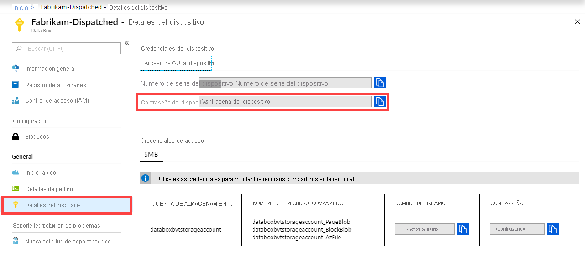

Para obtener la contraseña del dispositivo, inicie sesión en [Azure Portal](https://portal.azure.com) y abra el pedido. Vaya a **General > Device details** (General > Detalles del dispositivo). Copie el valor de **Device password** (Contraseña del dispositivo). 

