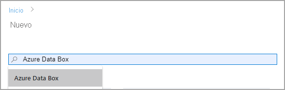
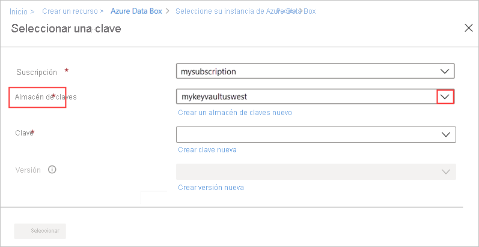
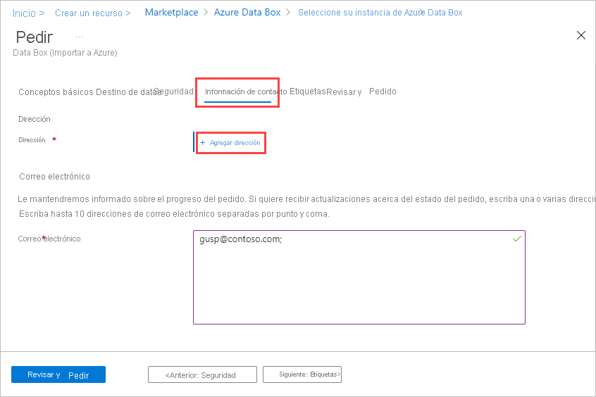

Para solicitar un dispositivo, realice los pasos siguientes en Azure Portal:

1. Use sus credenciales de Microsoft Azure para iniciar sesión en esta dirección URL: [https://portal.azure.com](https://portal.azure.com).
2. Seleccione **+ Crear un recurso** y busque *Azure Data Box*. Seleccione **Azure Data Box**.

   

3. Seleccione **Crear**.  

   

4. Compruebe si el servicio Data Box está disponible en su región. Escriba o seleccione los siguientes datos y haga clic en **Aplicar**.

    |Configuración  |Value  |
    |---------|---------|
    |Tipo de transferencia     | Seleccione **Importar en Azure**.        |
    |Subscription     | Seleccione una suscripción patrocinada por EA, CSP o Azure para el servicio Data Box.   La suscripción está vinculada a la cuenta de facturación.       |
    |Resource group | Seleccione un grupo de recursos existente. Un grupo de recursos es un contenedor lógico para los recursos que se pueden administrar o implementar conjuntamente. |
    |País o región de origen    |    Seleccione el país o región en que residen los datos actualmente.         |
    |Región de Azure de destino     |     Seleccione la región de Azure a la que desea transferir los datos.   Para más información, consulte la [disponibilidad regional de Data Box](../articles/databox/data-box-overview.md#region-availability) o la [disponibilidad regional de Data Box Heavy](../articles/databox/data-box-heavy-overview.md#region-availability).  |

    

5. Seleccione el producto **Data Box** producto que desea solicitar, ya sea Data Box, como se muestra a continuación, o Data Box Heavy. 

    

    En el caso de Data Box, la capacidad máxima utilizable para un solo pedido es 80 TB. En el caso de Data Box, la capacidad máxima utilizable para un solo pedido es 770 TB. Para tamaños de datos mayores puede crear varios pedidos.

    Si selecciona **Data Box Heavy**, el equipo de Data Box comprueba la disponibilidad del dispositivo en su región. Le notificarán cuándo puede continuar con el pedido.

6. En **Pedido**, vaya a la pestaña **Datos básicos** y escriba o seleccione la siguiente información. Luego, seleccione **Siguiente: Destino de datos**.

    |Configuración  |Value  |
    |---------|---------|
    |Suscripción      | La suscripción se rellena automáticamente según la selección anterior.|
    |Resource group    | Grupo de recursos especificado anteriormente. |
    |Nombre del pedido de importación | Especifique un nombre descriptivo para hacer un seguimiento del pedido. <ul><li>El nombre puede tener entre 3 y 24 caracteres, que pueden ser una letra, un número o un guion.</li><li>El nombre debe empezar y terminar con una letra o un número.</li></ul>    |

    

7. En la pantalla **Destino de datos**, seleccione el **destino de los datos**, ya sea Cuentas de almacenamiento o Discos administrados.

    Si elige **Cuentas de almacenamiento** como destino de almacenamiento, aparecerá la siguiente pantalla:

    

    En función de la región de Azure especificada, seleccione una o varias cuentas de almacenamiento en la lista filtrada de las cuentas de almacenamiento existentes. Data Box se puede vincular con un máximo de diez cuentas de almacenamiento. También puede crear una nueva **cuenta de uso general v1**, **cuenta de uso general v2** o **cuenta de almacenamiento de blobs**.

   > [!NOTE]
   > - Si selecciona cuentas de Azure Premium FileStorage, la cuota aprovisionada en el recurso compartido de la cuenta de almacenamiento aumentará hasta el tamaño de los datos que se copian en los recursos compartidos de archivos. Una vez que aumenta la cuota, no se vuelve a ajustar si, por ejemplo, por alguna razón Data Box no puede copiar los datos.
   > - Esta cuota se utiliza para la facturación. Una vez cargados los datos en el centro de datos, debe ajustar la cuota a sus necesidades. Para más información, consulte [Descripción de la facturación](../articles/storage/files/understanding-billing.md).

    Se admiten cuentas de almacenamiento con redes virtuales. Para permitir que el servicio de Data Box trabaje con cuentas de almacenamiento seguro, habilite los servicios de confianza dentro de la configuración de firewall de la red de la cuenta de almacenamiento. Para obtener más información, vea cómo [agregar Azure Data Box como un servicio de confianza](../articles/storage/common/storage-network-security.md#exceptions).

    Si usa Data Box para crear **discos administrados** desde los discos duros virtuales locales (VHD), también tendrá que proporcionar la siguiente información:

    |Configuración  |Value  |
    |---------|---------|
    |Grupos de recursos     | Cree grupos de recursos si pretende crear discos administrados desde los discos duros virtuales locales. Puede usar un grupo de recursos existente solo si ese grupo se creó anteriormente, al crear un pedido de Data Box para discos administrados por el servicio Data Box.   Especifique varios grupos de recursos separados por punto y coma. Se admite un máximo de 10 grupos de recursos.|

    

    La cuenta de almacenamiento especificada para los discos administrados se usa como una cuenta de almacenamiento provisional. El servicio Data Box carga los discos duros virtuales como blob en páginas en la cuenta de almacenamiento provisional y, a continuación, los convierte en discos administrados y los mueve a los grupos de recursos. Para más información, vea [Comprobación de la carga de datos en Azure](../articles/databox/data-box-deploy-picked-up.md#verify-data-upload-to-azure-8).

   > [!NOTE]
   > Si un blob en páginas no se convierte correctamente en un disco administrado, permanece en la cuenta de almacenamiento y se le cobra por el almacenamiento.

8. Seleccione **Siguiente: Seguridad** para continuar.

    La pantalla **Seguridad** le permite usar su propia clave de cifrado y sus propias contraseñas de dispositivo y recurso compartido, así como elegir usar el cifrado doble.

    Todos los valores de la pantalla **Security** (Seguridad) son opcionales. Si no cambia ninguna configuración, se aplicará la configuración predeterminada.

    

9. Si quiere usar su propia clave administrada por el cliente para proteger la clave de paso de desbloqueo del nuevo recurso, expanda **Tipo de cifrado**.

    La configuración de una clave administrada por el cliente para Azure Data Box es opcional. De manera predeterminada, Data Box usa una clave administrada por Microsoft para proteger la clave de paso de desbloqueo.

    Una clave administrada por el cliente no afecta a cómo se cifran los datos del dispositivo. Esa clave solo se usa para cifrar la clave de paso de desbloqueo del dispositivo.

    Si no desea usar una clave administrada por el cliente, vaya al paso 15.

   

10. Para usar una clave administrada por el cliente, seleccione **Clave administrada por el cliente** como tipo de clave. Luego, elija **Seleccione un almacén de claves y una clave**.
   
    

11. En la hoja **Select key from Azure Key Vault** (Seleccionar clave de Azure Key Vault):

    - El campo **Suscripción** se rellena automáticamente.

    - Para **Almacén de claves**, puede seleccionar un almacén de claves existente de la lista desplegable.

      

      O bien, seleccione **Create new key vault** (Crear almacén de claves). 
    
            

      En la pantalla **Crear almacén de claves**, escriba el grupo de recursos y el nombre del almacén de claves. Asegúrese de que estén habilitadas las opciones **Eliminación temporal** y **Protección de purga**. Acepte los restantes valores predeterminados y seleccione **Revisar y crear**.

      

      Revise la información del almacén de claves y seleccione **Crear**. Espere un par de minutos hasta que se complete la creación del almacén de claves.

      

12. La hoja **Seleccionar una clave** mostrará el almacén de claves seleccionado.

    

    Si desea crear una clave, seleccione **Crear nueva clave**. Debe usar una clave RSA. El tamaño puede ser de 2048 o superior. Escriba un nombre para la clave nueva, acepte los otros valores predeterminados y seleccione **Crear**.

      

      Recibirá una notificación cuando se haya creado la clave en el almacén de claves. La nueva clave se seleccionará y se mostrará en la hoja **Seleccionar una clave**.

13. Seleccione el valor de **Versión** de la clave que va a usar y, a continuación, elija **Seleccionar**.

      

    Si desea crear una versión de la clave, seleccione **Crear versión nueva**.

    

    Elija la configuración de la nueva versión de la clave y seleccione **Crear**.

    

    La configuración de **Tipo de cifrado** en la pantalla **Seguridad** muestra el almacén de claves y la clave.

    

14. Seleccione una identidad de usuario que vaya a usar para administrar el acceso a este recurso. Elija **Select a user identity** (Seleccione una identidad de usuario). En el panel de la derecha, seleccione la suscripción y la identidad administrada que se va a usar. Luego, elija **Seleccionar**.

    Una identidad administrada asignada por el usuario es un recurso independiente de Azure que se puede usar para administrar varios recursos. Para más información, consulte [Tipos de identidad administrada](../articles/active-directory/managed-identities-azure-resources/overview.md).  

    Si necesita crear una identidad administrada, siga la guía que se proporciona en [Creación, enumeración, eliminación o asignación de un rol a una identidad administrada asignada por el usuario mediante Azure Portal](../articles/active-directory/managed-identities-azure-resources/how-to-manage-ua-identity-portal.md).
    
    

    La identidad del usuario se muestra en la configuración **Tipo de cifrado**.

    

15. Si no desea usar las contraseñas generadas por el sistema que Azure Data Box utiliza de manera predeterminada, expanda **Bring your own password** (Aportar su propia contraseña) en la pantalla **Seguridad**.

    Las contraseñas generadas por el sistema son seguras y se recomiendan a menos que su organización lo requiera de otro modo.

     

   - Para usar su propia contraseña para el nuevo dispositivo, para **Set preference for the device password** (Establecer preferencia para la contraseña del dispositivo), seleccione **Use your own password** (Usar su propia contraseña) y escriba una contraseña que cumpla los requisitos de seguridad.
     
     La contraseña debe ser alfanumérica y contener entre 12 y 15 caracteres, con al menos una letra mayúscula, una letra minúscula, un carácter especial y un número.

     - Caracteres especiales permitidos: @ # - $ % ^ ! + = ; : _ ( )
     - Caracteres no permitidos: I i L o O 0
   
     

 - Para usar sus propias contraseñas para recursos compartidos:

   1. En **Set preference for share passwords** (Establecer preferencia para las contraseñas de los recursos compartidos), seleccione **Use your own passwords** (Usar sus propias contraseñas) y, a continuación, seleccione **Select passwords for the shares** (Seleccionar contraseñas para los recursos compartidos).
     
       

    1. Escriba una contraseña para cada cuenta de almacenamiento del pedido. La contraseña se utilizará en todos los recursos compartidos de la cuenta de almacenamiento.
    
       La contraseña debe ser alfanumérica y contener entre 12 y 64 caracteres, con al menos una letra mayúscula, una letra minúscula, un carácter especial y un número.

       - Caracteres especiales permitidos: @ # - $ % ^ ! + = ; : _ ( )
       - Caracteres no permitidos: I i L o O 0
     
    1. Para utilizar la misma contraseña para todas las cuentas de almacenamiento, seleccione **Copy to all** (Copiar en todas). 

    1. Cuando termine, seleccione **Save** (Guardar).
     
       

    En la pantalla **Seguridad**, puede usar **View or change passwords** (Ver o cambiar contraseñas) para cambiar las contraseñas.

16. En **Security** (Seguridad), si quiere habilitar el cifrado doble basado en software, expanda **Double-encryption (For high-security environments)** (Cifrado doble [para entornos de alta seguridad]) y seleccione **Enable double encryption for the order** (Habilitar el cifrado doble para el pedido).

    

    El cifrado basado en software se realiza junto con el cifrado AES de 256 bits de los datos en Data Box.

    > [!NOTE]
    > La habilitación de esta opción puede hacer que el procesamiento de pedidos y la copia de datos tarden más. Esta opción no se puede cambiar después de crear el pedido.

    Seleccione **Siguiente: Detalles de contacto>** para continuar.

17. En **Detalles de contacto**, seleccione **+ Agregar dirección**.

    

18. En **Agregar dirección**, especifique su nombre y apellidos, el nombre y la dirección postal de la empresa y un número de teléfono válido. Seleccione **Validar la dirección**. El servicio valida la dirección para la disponibilidad del servicio y le envía una notificación si el servicio está disponible para esa dirección.

    

    Si ha seleccionado el envío autoadministrado, recibirá una notificación por correo electrónico una vez que se haya realizado correctamente el pedido. Para obtener más información sobre el envío autoadministrado, consulte [Uso del envío autoadministrado](../articles/databox/data-box-portal-customer-managed-shipping.md).

19. Seleccione **Agregar dirección de envío** una vez que se haya comprobado que los detalles sean correctos. Volverá a la pestaña **Detalles de contacto**.

20. Al lado de **Correo electrónico**, agregue una o varias direcciones de correo electrónico. El servicio envía notificaciones por correo electrónico si se produce cualquier actualización en el estado del pedido a las direcciones de correo electrónico especificadas.

    Es aconsejable usar un correo electrónico de grupo, con el fin de que siga recibiendo notificaciones aunque algún administrador deje el grupo.

    

21. Examine la información de **Revisar y pedir** del pedido, el contacto, la notificación y los términos de privacidad. Active la casilla correspondiente a contrato acuerdo con los términos de privacidad.

22. Seleccione **Pedido**. El pedido tarda unos minutos en crearse.

    