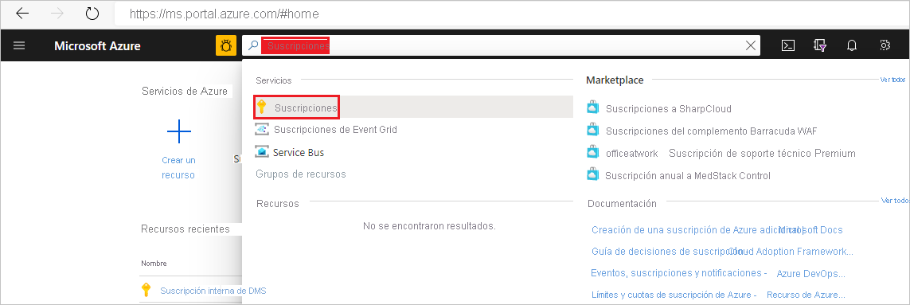

## Registro del proveedor de recursos Microsoft.DataMigration

1. Inicie sesión en Azure Portal. Busque y seleccione **Suscripciones**.

   

2. Seleccione la suscripción en la que quiere crear la instancia de Azure Database Migration Service y después seleccione **Proveedores de recursos**.

    

3. Busque la migración y, después, seleccione **Registrar** para **Microsoft.DataMigration**.

        
