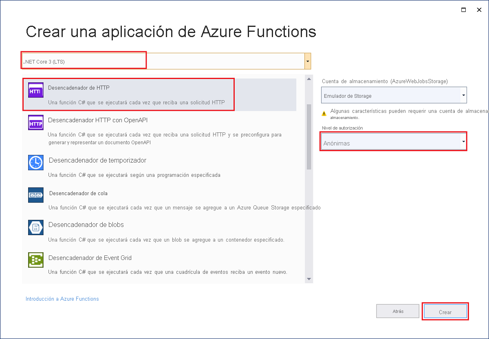
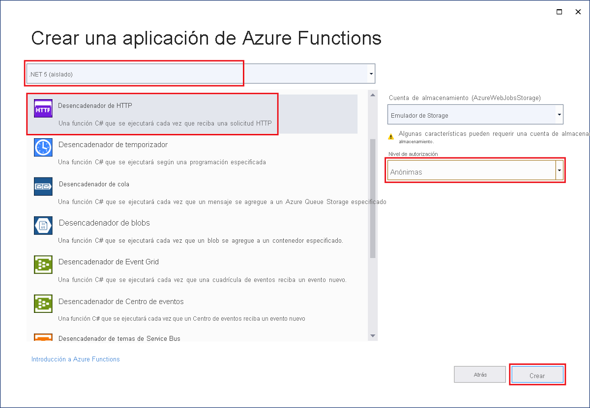

La plantilla del proyecto de Azure Functions de Visual Studio crea un proyecto de biblioteca de clases de C# que puede publicar en una aplicación de funciones en Azure. Una aplicación de funciones permite agrupar funciones como una unidad lógica para facilitar la administración, la implementación, el escalado y el uso compartido de recursos.

1. En el menú de Visual Studio, seleccione **Archivo** > **Nuevo** > **Proyecto**.

1. En **Crear un proyecto**, escriba *functions* en el cuadro de búsqueda, elija la plantilla **Azure Functions** y seleccione **Siguiente**.

1. En **Configurar el nuevo proyecto**, escriba un **nombre de proyecto**  para el proyecto y, a continuación, seleccione **Crear**. El nombre de la aplicación de función debe ser válido como espacio de nombres de C#, por lo que no debe usar guiones bajos, guiones u otros caracteres no alfanuméricos.

1. En la configuración de **Crear aplicación de Azure Functions**, use los valores de la tabla siguiente:

    # [En proceso](#tab/in-process) 

    | Configuración      | Value  | Descripción                      |
    | ------------ |  ------- |----------------------------------------- |
    | **Versión de .NET** | **.NET Core 3 (LTS)** | Este valor crea un proyecto de función que se ejecuta dentro de proceso con la versión 3.x del entorno de ejecución de Azure Functions. Azure Functions 1.x admite .NET Framework. Para más información, consulte [Selección de un destino para versiones de runtime de Azure Functions](../articles/azure-functions/functions-versions.md).   |
    | **Plantilla de función** | **desencadenador HTTP** | Este valor crea una función desencadenada por una solicitud HTTP. |
    | **Cuenta de almacenamiento (AzureWebJobsStorage)**  | **Emulador de Storage** | Dado que una aplicación de funciones de Azure necesita una cuenta de almacenamiento, se asigna o se crea una cuando publica su proyecto en Azure. Un desencadenador HTTP no utiliza una cadena de conexión de cuenta de Azure Storage; todos los demás tipos de desencadenador requieren una cadena de conexión de cuenta de Azure Storage válida.  |
    | **Nivel de autorización** | **Anónimo** | Cualquier cliente puede desencadenar una función creada sin tener que proporcionar una clave. Esta configuración de autorización facilita probar la función nueva. Para más información sobre las claves y la autorización, consulte [Claves de autorización](../articles/azure-functions/functions-bindings-http-webhook-trigger.md#authorization-keys) e [Introducción a los enlaces y desencadenadores HTTP de Azure Functions](../articles/azure-functions/functions-bindings-http-webhook.md). |
    
    
    

    # [Proceso aislado](#tab/isolated-process)

    | Configuración      | Value  | Descripción                      |
    | ------------ |  ------- |----------------------------------------- |
    | **Versión de .NET** | **.NET 5 (aislado)** | Este valor crea un proyecto de función que se ejecuta en un proceso aislado, que admite .NET 5.0. Para más información, consulte [Selección de un destino para versiones de runtime de Azure Functions](../articles/azure-functions/functions-versions.md).   |
    | **Plantilla de función** | **desencadenador HTTP** | Este valor crea una función desencadenada por una solicitud HTTP. |
    | **Cuenta de almacenamiento (AzureWebJobsStorage)**  | **Emulador de Storage** | Dado que una aplicación de funciones de Azure necesita una cuenta de almacenamiento, se asigna o se crea una cuando publica su proyecto en Azure. Un desencadenador HTTP no utiliza una cadena de conexión de cuenta de Azure Storage; todos los demás tipos de desencadenador requieren una cadena de conexión de cuenta de Azure Storage válida.  |
    | **Nivel de autorización** | **Anónimo** | Cualquier cliente puede desencadenar una función creada sin tener que proporcionar una clave. Esta configuración de autorización facilita probar la función nueva. Para más información sobre las claves y la autorización, consulte [Claves de autorización](../articles/azure-functions/functions-bindings-http-webhook-trigger.md#authorization-keys) e [Introducción a los enlaces y desencadenadores HTTP de Azure Functions](../articles/azure-functions/functions-bindings-http-webhook.md). |
    
    
    

    ---

    Asegúrese de establecer el **Nivel de autorización** en **Anónimo**. Al elegir el nivel predeterminado de **Función**, tiene que presentar la [tecla de función](../articles/azure-functions/functions-bindings-http-webhook-trigger.md#authorization-keys) en las solicitudes para acceder al punto de conexión de la función.

1. Seleccione **Crear** para crear el proyecto de función y la función con desencadenador HTTP.
